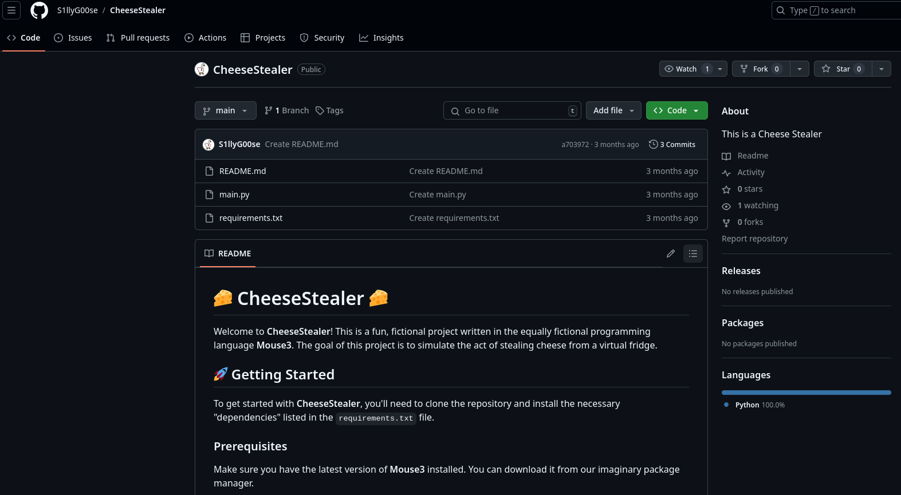
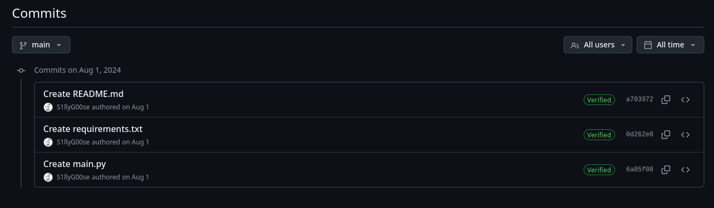
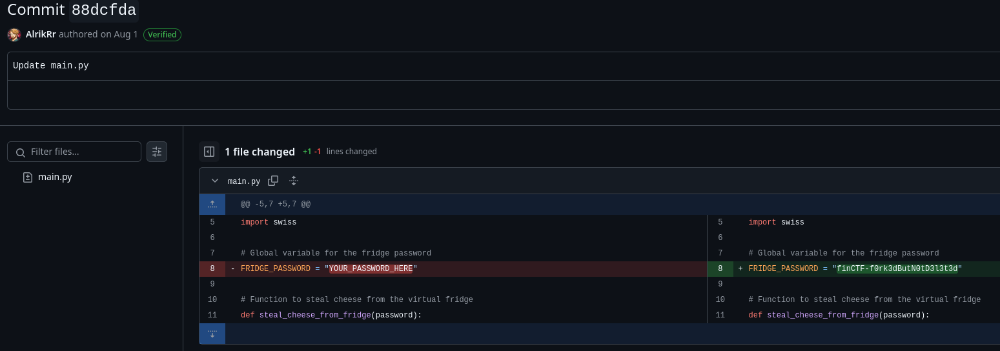
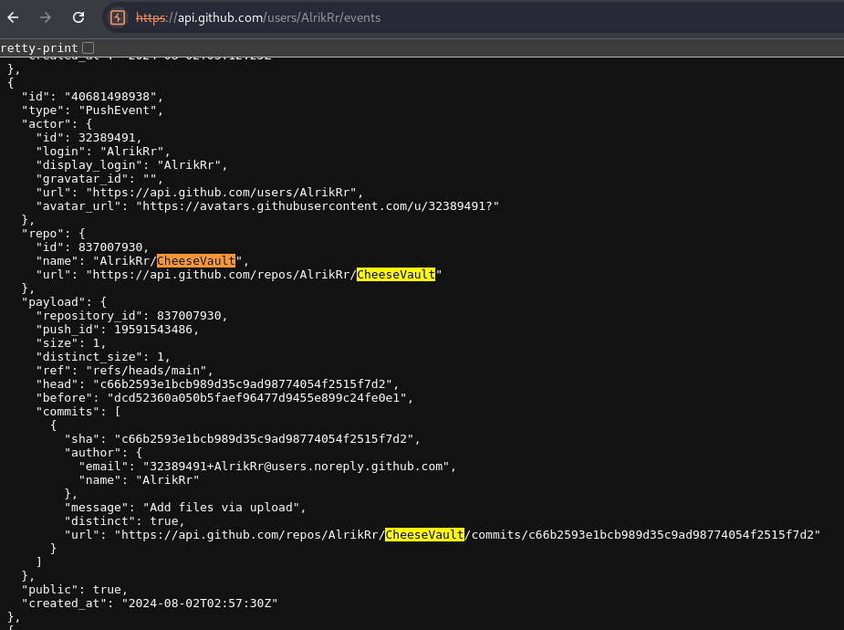
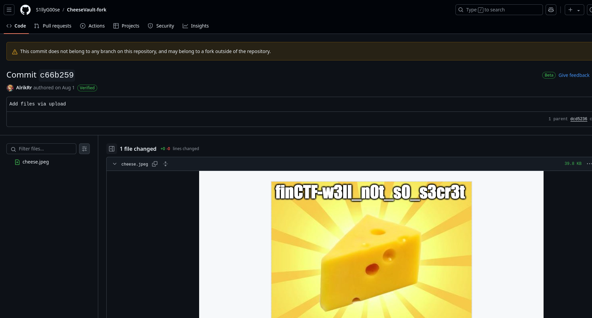

# Github

Ce défi est en deux parties et traite de certains comportements de la plateforme Github.

## Partie 1: Fourchette Supprimée 🍴

>Vous êtes un cyber-enquêteur, votre cible est un voleur de Cyber-fromage. Par chance, vous avez récupéré une clé USB lui appartenant, mais celle-ci a été formatée ! Votre collègue, très peu expérimenté, a quand même réussi à récupérer quelques informations précieuses :
>
>Le lien d'un repo GitHub malheureusement >supprimé, on dirait un fork, non ?
>
>https://github.com/AlrikRr/CheeseStealer-fork
>
>Ainsi que le morceau du hash d'un commit, apparemment le hash ne fait que 4 caractères de long (c'est votre collègue qui le dit ... ). Les deux derniers caractères sont “dc” mais il vous manque les 2 premiers chiffres ...
>
>Après quelques heures d'OSINT, vous vous rendez compte qu'il s'agit en réalité d'un FORK du repo suivant :
>
>https://github.com/S1llyG00se/CheeseStealer
>
>Parviendrez-vous à retrouver le commit supprimé contenant le secret ?

Le but est de récupérer un commit distinct du 'fork' `AlrikRr/CheeseStealer-fork`

Ce qu'il faut comprendre de Github c'est, qu'à l'interne, un 'fork' n'est qu'une branche glorifiée d'un même arbre sous un autre utilisateur. Tout les 'commits' d'un 'fork' sont lié au parent. Donc, si on recherche un commit d'un fork supprimé, on a qu'à rechercher un dangling commit dans le repos parent. Oh pardon, on est à Desjardins... francisation! On recherche un engagement d'une fourchette supprimée qui pendouille.


Si on regarde le repos du fork, il n'existe effectivement plus.



Du côté `S1llyG00se/CheeseStealer` on a le repos d'une application `Mouse3` servant à voler le fromage d'une frigo virtuel. Les détails sur l'utilisation du cheese stealer et ses implications ont en dehors de la portée ce ce write-up.



Autrement, le repos n'a qu'une seule branche et trois commits.

Dans la description du défi, on nous indique que les caractères trois et quatre du 'hash' du commit commence sont `dc`. Github permet la simplification des hash et va résoudre par défaut un 'hash' unique de sept caractère de long au lieu des 40, mais il accepte aussi un hash aussi court que quatre de long. Vraiment idéal si on est un 'data scraper'!

Ça veux dire qu'on a que deux caractères alphanumériques a deviner pour retrouver le commit désiré.

Un [simple script Python](./CheeseUndeleter.py) (prédécesseur de Mouse3) nous permet de tester les URLs.

```python
# Base URL with placeholders
base_url = "https://github.com/S1llyG00se/CheeseStealer/commit/?!dc"

# Possible characters (alphanumeric)
characters = string.ascii_letters + string.digits

# Iterate over all possible combinations of two missing characters
for char1 in characters:
    for char2 in characters:
        # Construct the URL
        url = base_url.replace('?', char1).replace('!', char2)
        
        response = requests.get(url)
        
        # Invalid URL gives 404
        if response.status_code == 200:
            print(f"Valid URL: {url}")
            break
        
        # Sleep a bit, rate limiter will be angry
        time.sleep(0.5)
```

Après relativement peu de temps on obtient cet URL:

`Valid URL: https://github.com/S1llyG00se/CheeseStealer/commit/88dc`

Ce qui nous donne notre premier flag et le mot de passe du frigo



## Partie 2: Repo Supprimée 🫥

>Votre collègue a retrouvé un autre indice sur la clé USB formatée !
>
>L'adresse d'un autre repo GitHub :
>
>https://github.com/AlrikRr/CheeseVault
>
>Mais malheureusement, il a été supprimé par notre voleur ...
>
>Par chance, vous vous rendez compte que ce repo a été fork à cette adresse :
>
>https://github.com/S1llyG00se/CheeseVault-fork
>
>D'après ce que votre collègue vous a dit, un dernier commit a été poussé sur le repo original avant d'être supprimé ! Ah ! Et le hash fait 4 caractères de long, il connaît le premier et le troisième : 9 - b -
>
>Parviendrez-vous à le retrouver ?

Pour ce défi, c'est le même concept mais dans l'autre sens. Encore une fois quand un repos est supprimé, les forks ont toujours accès aux commit 'dangling'. De plus quand un repos 'racine' est supprimé, le premier fork sera promu comme nouveau repos principal.

On remarque que le repos `AlrikRr/CheeseVault`est bel et bien supprimé, mais par contre l'utilisateur existe toujours. On peut donc utiliser les API Github pour consulter l'historique des événements.

`https://api.github.com/users/AlrikRr/events`


Si on recherche les événement en lien avec `CheeseVault`, on peut trouver ceci:



Ce qui nous donne cet URL contenant le hash d'un commit qui n'est pas présent dans le fork:

`https://api.github.com/repos/AlrikRr/CheeseVault/commits/c66b2593e1bcb989d35c9ad98774054f2515f7d2`

Si on suis ce lien on tombe évidament sur un 404, mais si on utilise ce hash sur le repos fork:

`https://github.com/S1llyG00se/CheeseVault-fork/commit/c66b2593e1bcb989d35c9ad98774054f2515f7d2`

On obtient le fromage et notre deuxième flag `finCTF-w3ll_n0t_s0_s3cr3t`


