# Reverse Me!

Challenge en trois partie sur la rétro-ingénierie d'un exécutable

>Après un incident de ransomware, ce binaire mystérieux a été découvert sur le poste de la victime. Il s'agit d'un programme de débogage qui a été oublié par l'attaquant et qui pourrait aider à récupérer les fichiers affectés. Votre mission est de trouver les clés secrètes cachées à l'intérieur. Bonne chance !

## Partie 1

On nous fourni, un fichier binaire nommé `reverseme`

Un `file` rapide sur le fichier nous indique qu'il s'agit d'un exécutable Linux.

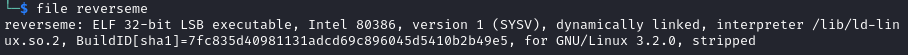

Si on éxécute le programme, on nous rejette l'accès

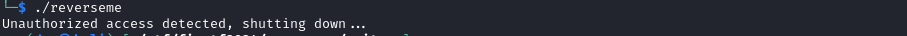

On va utiliser Ghidra pour tenter de contourner cette restriction. On importe le binaire avec les options proposées et on fait l'analyse initiale.

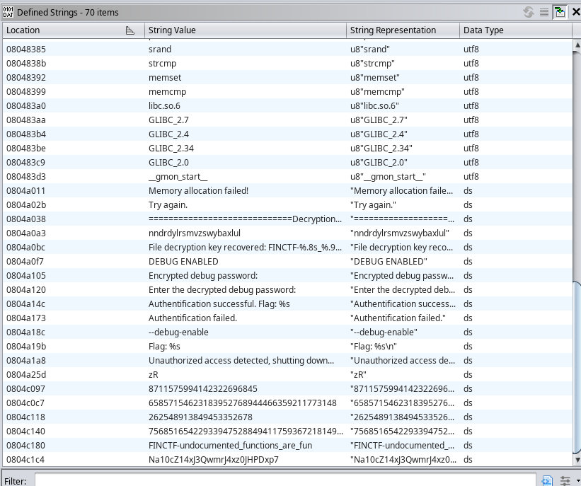

Si on ouvre la liste des chaînes définies, on y trouve immédiatement notre premier flag. Il serait intéressant par contre de comprendre comment obtenir ce résultat. On peut suivre la référence au message d'erreur qu'on a eu `Unauthorized access detected, shutting down...` pour voir la logique derrière.

Dans ce cas ci, la chaîne est définie à même la fonction. Si on retourne a la vue de décompilation à cette adresse on a la fonction complète.

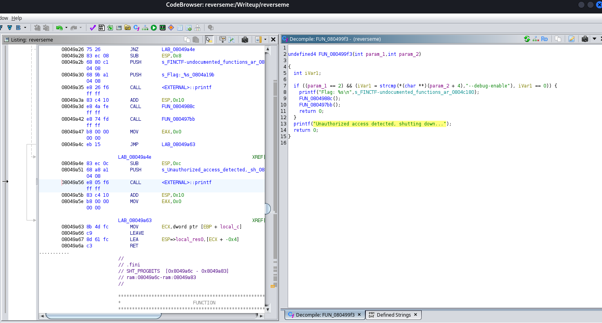

On semble vérifier qu'on a deux arguments à l'appel du programme et que le deuxième est un flag `--debug-enable`. Le premier argument étant le nom de l’exécutable, on a juste a inclure cet argument a notre appel pour obtenir le premier flag de façon plus légitime.

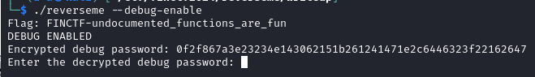

## Partie 2

>Pour la prochaine étape, le mode de débogage nécessite un mot de passe pour continuer. Bonne chance !

Maintenant qu'on a passé la première validation. On nous demande de décrypter un mot de passe.

Si on retourne dans le code désassemblé, on vois deux appels de fonction après l'affichage du premier flag. Explorons le premier.

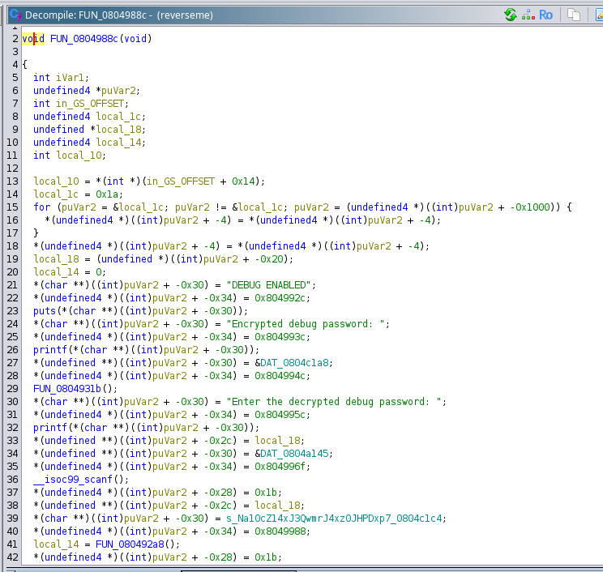

On y vois les mêmes messages qu'à l’exécution, on est au bon endroit.

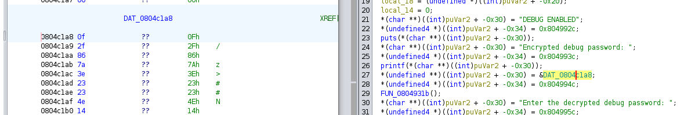

On vois aussi le message codé à cet adresse. Il y a forcément une fonction qui encode un input et compare avec cette variable.

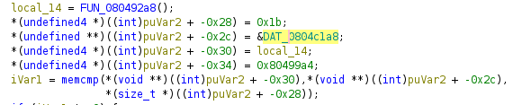

Un peu plus bas on vois cette même adresse près d'un `memcmp` (memory compare). Elle est comparé à `local_14` qui elle est le résultat de la fonction `FUN_080492a8()`. On peut supposer que cette méthode gère la lecture de l'input et l'encodage. Allons vérifier.

```c
void * FUN_080492a8(int param_1,int param_2,uint param_3)

{
  void *__s;
  uint local_14;
  
  __s = malloc(param_3 + 1);
  memset(__s,0,param_3 + 1);
  for (local_14 = 0; local_14 < param_3; local_14 = local_14 + 1) {
    *(byte *)((int)__s + local_14) =
         (*(byte *)(param_2 + local_14) ^ *(byte *)(param_1 + local_14)) + 7;
  }
  return __s;
}

```

On peut voir que la fonction semble faire un XOR sur chaque byte d'un buffer.

Ma théorie est donc incorrecte, les paramètres viennent de la fonction précédente. Ghidra n'a pas tout à fait interprété le contexte d'appel correctement. Retournons à l'appel de `FUN_080492a8` voir comment la clé est passée.

```c
  *(char **)((int)puVar2 + -0x30) = "Enter the decrypted debug password: ";
  *(undefined4 *)((int)puVar2 + -0x34) = 0x804995c;
  printf(*(char **)((int)puVar2 + -0x30));
  *(undefined **)((int)puVar2 + -0x2c) = local_18;
  *(undefined **)((int)puVar2 + -0x30) = &DAT_0804a145;
  *(undefined4 *)((int)puVar2 + -0x34) = 0x804996f;
  __isoc99_scanf();
  *(undefined4 *)((int)puVar2 + -0x28) = 0x1b;
  *(undefined **)((int)puVar2 + -0x2c) = local_18;
  *(char **)((int)puVar2 + -0x30) = s_Na10cZ14xJ3QwmrJ4xz0JHPDxp7_0804c1c4;
  *(undefined4 *)((int)puVar2 + -0x34) = 0x8049988;
  local_14 = FUN_080492a8();

```

[`__isoc99_scanf`](https://codebrowser.dev/glibc/glibc/stdio-common/isoc99_scanf.c.html) est la fonction permettant de capturer un input utilisateur. Le résultat semble être copié dans `local_18`

Plus bas avant l'appel on à la constante `0x1b` (27 en décimale) qui semble être la longueur du buffer en dur. Ensuite viens l'input utilisateur et ensuite une référence a un autre buffer. Si on suis cette référence, on a une structure d'exactement 27 bytes, alors c'est probablement la clé!

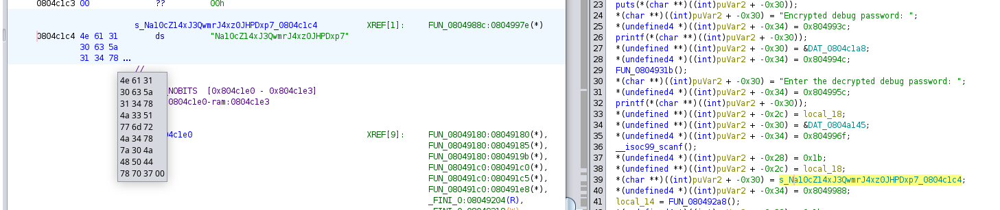

Donc:

- `param1` semble être la clé
- `param2` semble être l'input a encrypter
- `param3` est la longueur de l'input/clé en dur

On peut faire un `Menu contextuel -> Copy special ... -> Python Byte String` pour copier la clé et le message codé avant d'implémenter la fonction de décryptions en Python.

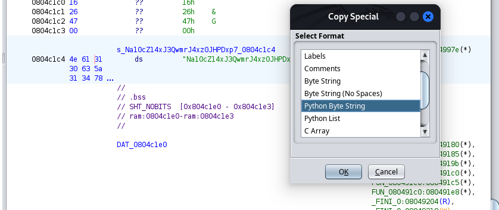

Normalement, pour renverser un XOR il suffi de le refaire, mais la fonction d'encryption additionne 7 a chaque byte. Alors nous on dois le soustraire.

```python
crypted = b'\x0f\x2f\x86\x7a\x3e\x23\x23\x4e\x14\x30\x62\x15\x1b\x26\x12\x41\x47\x1e\x2c\x64\x46\x32\x3f\x22\x16\x26\x47'
key =     b'\x4e\x61\x31\x30\x63\x5a\x31\x34\x78\x4a\x33\x51\x77\x6d\x72\x4a\x34\x78\x7a\x30\x4a\x48\x50\x44\x78\x70\x37'
lenght = len(crypted) # 0x1b == 27

# Buffer for the result
buffer = bytearray(lenght)

for i in range(lenght):
    # Encrypt function adds 7 to the input, so we need to subtract for decryption
    buffer[i] = (crypted[i] - 7) ^ key[i]

# Convert the buffer to a string
result = ''.join(chr(b) for b in buffer)

print(result)

```

On exécute et on obtient le mot de passe qui est aussi notre deuxième flag

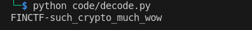

[Script complet ici](./decode_part2.py)

## Partie 3

>Avant de pouvoir obtenir la clé de déchiffrement finale, il va falloir faire preuve de créativité pour résoudre l'input d'une fonction à logique complexe. Bonne chance !

Si on revien au programme et que l'on saisie le mot de passe obtenu dans la partie deux, on avance plus loin dans l'éxécution.

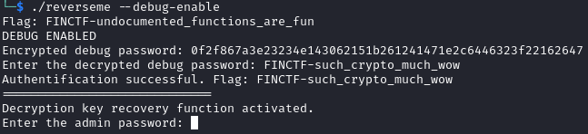

Il faut maintenant découvrir le mot de passe administrateur. On se souviens qu'il y avait deux fonctions au début. La première gère la partie 2, probablement la deuxième traite cette partie. Allons voir.

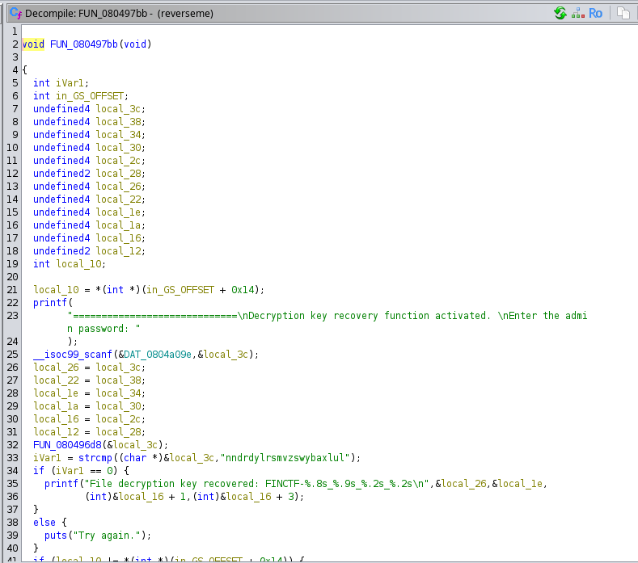

En effet, `FUN_080497bb` correspond a ce qu'on vois. Si on analyse, le programme nous donne un flag si notre input correspond à la chaîne `nndrdylrsmvzswybaxlul` après avoir été transformé par la fonction `FUN_080496d8`. Cette fonction est donc sûrement une fonction d'encryption.

```c
int FUN_080496d8(int param_1)
{
  undefined uVar1;
  int local_10;
  
  FUN_080494ca();
  FUN_080495d0();
  for (local_10 = 0; local_10 < 0x15; local_10 = local_10 + 1) {
    uVar1 = FUN_080493e7((int)*(char *)(param_1 + local_10),
                         (int)(char)PTR_s_75685165422933947528849411759367_0804c17c
                                    [(char)PTR_s_75685165422933947528849411759367_0804c17c[local_10]
                                     % '('],
                         PTR_DAT_0804c178[local_10 * 2] +
                         PTR_DAT_0804c170[local_10] + PTR_DAT_0804c174[local_10 * 2]);
    *(undefined *)(param_1 + local_10) = uVar1;
  }
  return param_1;
}
```

Ici on vois que la chaîne input est passée à la fonction `FUN_080493e7` byte par byte avec d'autre bytes provenant de pointeur en mémoire... continuons un vers cette fonctions.

```c
int FUN_080493e7(int param_1,int param_2,int param_3)
{
  if ((0x60 < param_1) && (param_1 < 0x7b)) {
    return ((param_1 + -0x61 + param_3 * param_2) % 0x100 + 0x61 + param_2 * 0x100) % 0x1a + 0x61;
  }
  puts("Try again.");
                    /* WARNING: Subroutine does not return */
  exit(1);
}

```

Ok... ici on fait des opérations XOR avec nos paramètres et des constantes magiques. Le if semble a première vue valider que les bytes sont de la portée des caractères alphabétiques minuscule ([Entre 97 et 122 de la table ASCII inclusivement](https://www.asciitable.com/)).

On a donc, la logique d'encryption, il nous manque seulement les valeurs *"clés"* liées aux pointeurs vu précédemment.

le pointeur `PTR_s_75685165422933947528849411759367_0804c17c` pointe à l'adresse `0804c17c` qui contient un buffer. Facile ça va bien! On peux copier ça pour notre script d'encryption.

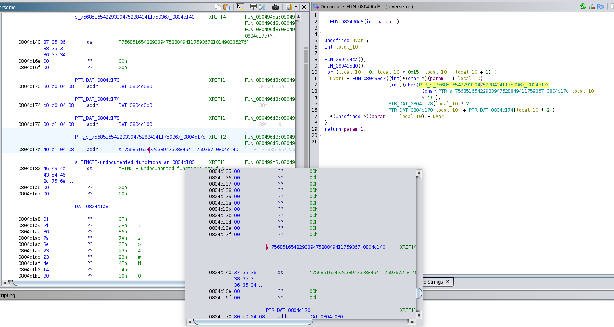

Il nous manque seulement `PTR_DAT_0804c178`, `PTR_DAT_0804c174` et `PTR_DAT_0804c170` Si on les regarde, normalement on devrait trouver des buffers de la même longueur que le premier.

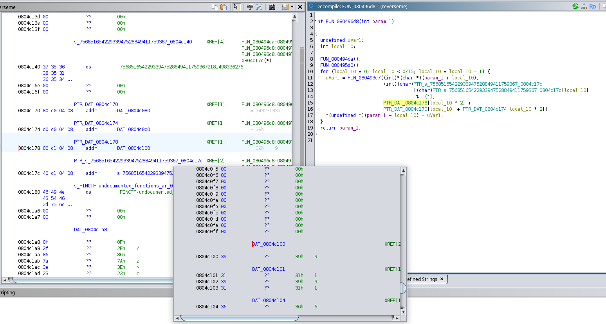

Oups... non pas pentoute... Il semble que se soit généré dynamiquement. Il y a deux appels au début de la méthode, est ce que ces fonctions initialise les autres clés?

Allons voir `FUN_080494ca` et `FUN_080495d0`...

Oh...

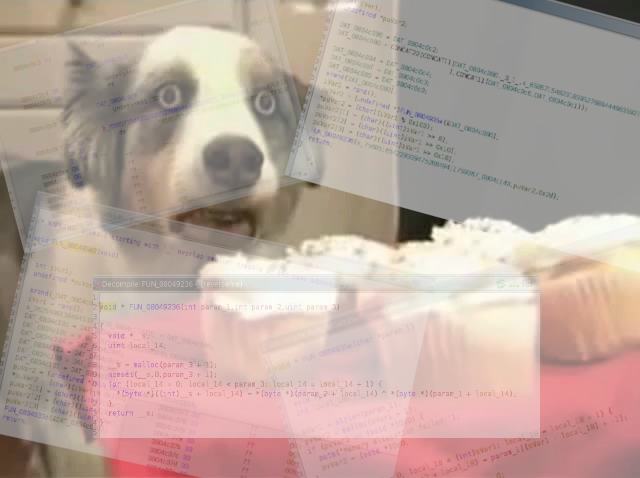

Ces fonction sont un "rabbit hole" de référence de concaténation de valeur aléatoire, de bit shift de XOR... nommez le on là! Si vous voulez une analyse en profondeur de ce que ces méthodes font, ce n'est pas ici que vous allez les trouver, car aucune idée. C'est trop complexe pour moi!

Il doit avoir une autre façon... si les clés sont générée au runtime, elles doivent bien être en mémoire à l’exécution. On peut attacher un débogueur et espionner un peu...

Je lance donc une session de débug à même Ghidra et met un breakpoint juste avant la boucle d'encryption.

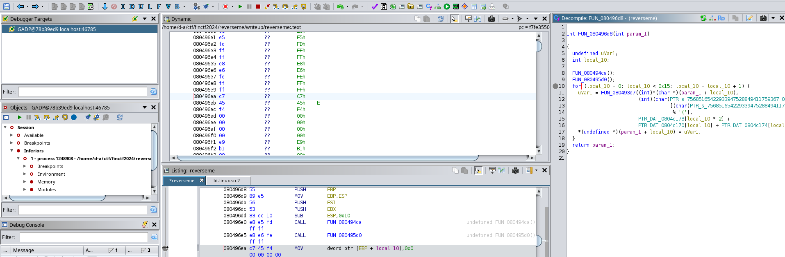

Je fais par contre face à un problème. Le débogueur Ghidra ne supporte pas la saisie STDIN... alors je suis coincé à l’exécution de la méthode de la partie 2. Pas pratique.

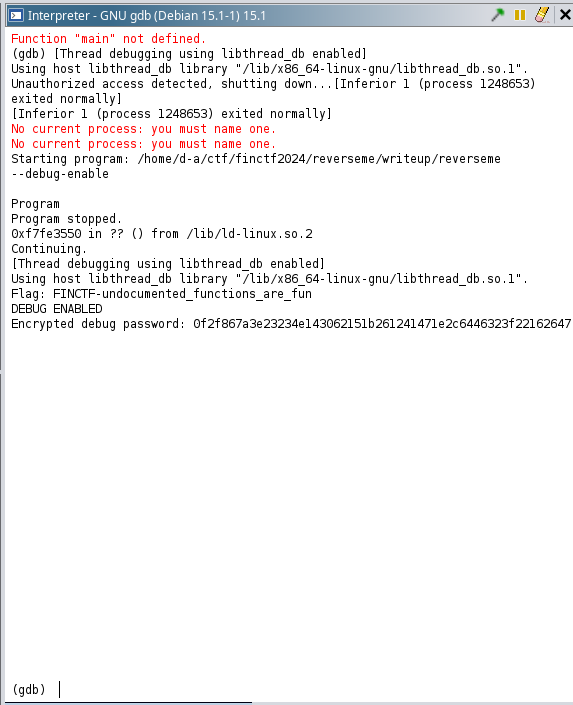

Je pourrais reconfigurer un environnement différent avec IDA ou bien apprendre à utiliser GDB directement... mais ça ne me tente pas... je veux juste voir la RAM!

On pourrait a la place faire une patch et enlever la partie 2 complètement...

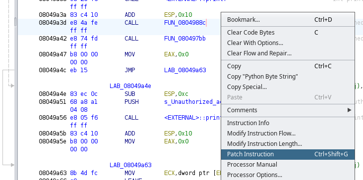

Quelques NOP plus tard, il reste que la partie qui nous intéresse. On peut exporter le nouveau binaire et relancer le debug.

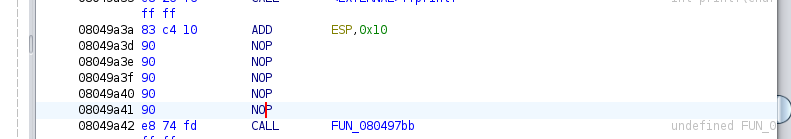

On arrive a notre fonction! Maintenant, si on suis les pointeur on trouve des buffers de la bonne taille.

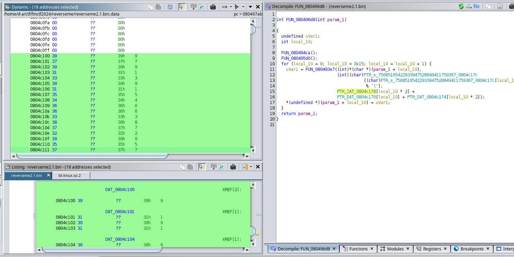

On copie en Python Byte String les cibles des trois pointeur et on a tout le data pour implémenter notre propre implémentation.

### La stratégie

Dans ce cas-ci, implémenter l'opération inverse est plutôt complexe. Par contre:

- On a la chaîne cible
- On sais que le mot de passe contient que des caractères [a-z]
- La longueur est la même que la cible soit 21
- La logique d'encryption est une boucle avec un XOR fancy
- On a une copie statique des clés.

Déterminer le mot de passe par une attaque "brute-force" est totalement envisageable. On a qu'a implémenter la logique tel quel et encrypter byte par byte en comparant avec le résultat cible.

Voici la méthode "brute-force"

```python
# Iterate through all possible [a-z] passwords until the expected output is found
def brute_force(expected):
    charset = ''.join(chr(i) for i in range(97, 123))  # Characters from 'a' to 'z'
    max_length = len(expected) 
    password = bytearray() 

    for i in range(max_length):
        for char in charset:
            tmp_pwd = password + bytearray(char.encode())
            encoded = encode(tmp_pwd.copy())
            if encoded[i] == expected[i]:
                password = tmp_pwd
                break

    print(f"Password found: {tmp_pwd.decode('utf-8')}")
    return

```

[Vous pouvez trouver le script complet ici](./decode_part3.py)

On exécute notre script et on obtient le mot de passe

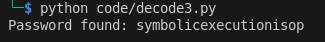

Et finalement, si on inscrit le ce mot de passe dans l'application, on reçoit notre dernier flag.

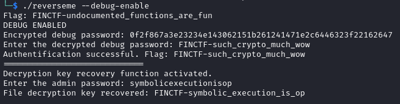