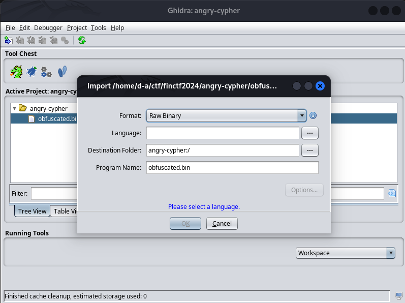
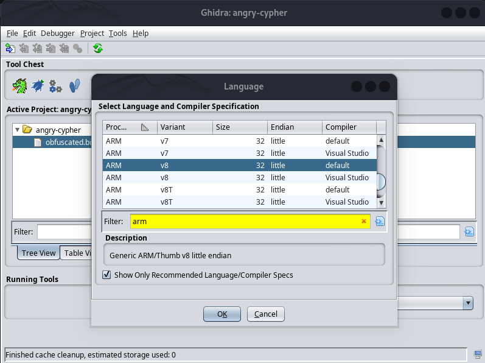
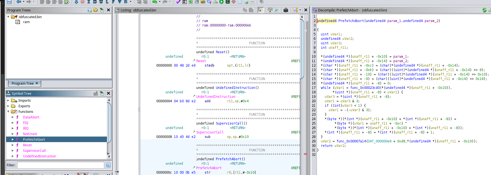
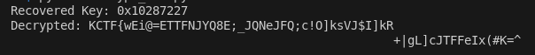
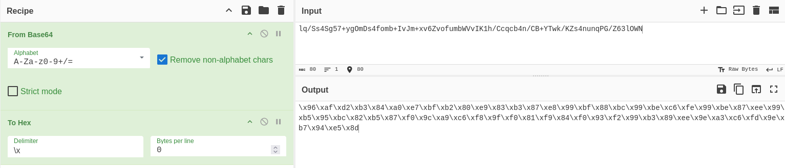
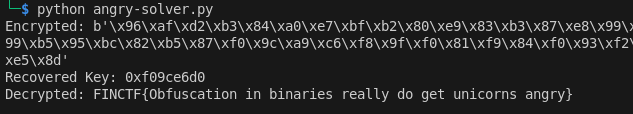

# Angry Cypher

## Description

>Vous travaillez pour le département de sécurité chez ACME Corp.
Vous isolez un appareil que vous suspectez d'envoyer des données confidentielles vers le fournisseur.
Bien entendu, la donnée envoyée est chiffrée en transit. De plus, l'appareil a des mesures techniques en place pour empêcher la lecture du code source propriétaire qui s'y trouve.
>
>Par chance, un autre chercher vous a envoyé un indice. Ce dernier a été en mesure d'extraire une petite, mais importante portion du code source de l'appareil; la fonction de déchiffrement. (obfuscated.bin) Finalement, il a aussi découvert que le texte clair est dans le format suivant: FINCTF{sensitive data here}
>
Le challenge Angry Cypher consiste a tenter de décrypter un message en analysant un fragment de fichier binaire.

## Mise en place

On nous fourni un fichier *cypher.txt* contenant ce texte:

`lq/Ss4Sg57+ygOmDs4fomb+IvJm+xv6ZvofumbWVvIK1h/Ccqcb4n/CB+YTwk/KZs4nunqPG/Z63lOWN`

On a aussi le fichier *obfuscated.bin* qui est en effet un fichier binaire. Dans l'introduction du challenge, on nous mentionne qu'il s'agit de la fonction de décryption d'une application.

Sachant que le .bin peut être interprété comme executable, on peut utiliser Ghidra pour désassembler la méthode.



Ghidra va avoir besoin d'un coup de main pour interpréter les instructions selon le bon format. La description fait mention d'appareils. Appareils mobiles? Si c'est le cas la cible serait un processeur ARM. On va tenter en utilisant un v8 générique.



Ghidra va tenter d'analyser le binaire comme un executable complet. Ça peut causer problème car nous n'avons pas un exécutable complet... Certaines addresses map vers des fonctions standardes que Ghidra tente d'interpréter comme méthodes.

Pour le moment, on va laisser Ghidra faire sa magie.



On vois qu'en effet, toutes sortes de fonction sont détectées. Elles sont toutes similaire à quelque détails près. C'est que les fonctions standardes se font mapper a l'intérieur du corp de notre fonction a différents offsets!

Puisqu'on a probablement qu'une seule fonction dans notre binaire. On peut prendre pour aquis que le représentation la plus juste serait à l'offset 0x0.


Le nom `Reset` peut être ignoré et les arguments ne sont peut-être pas tous valides. On peut par contre voir que la méthode décompilée fait du sens. (Presque!)

```c

  uint uVar1;
  undefined4 uVar2;
  byte abStack_10 [4];
  uint uStack_c;
 
  abStack_10[0] = (byte)param_2;
  abStack_10[1] = (byte)((uint)param_2 >> 8);
  abStack_10[2] = (byte)((uint)param_2 >> 0x10);
  abStack_10[3] = (byte)((uint)param_2 >> 0x18);
  uStack_c = 0;
  while (uVar1 = func_0x00023cd0(param_1), uStack_c < uVar1) {
    uVar1 = uStack_c & 3;
    if ((int)uStack_c < 1) {
      uVar1 = -(-uStack_c & 3);
    }
    *(byte *)(param_1 + uStack_c) = abStack_10[uVar1] ^ *(byte *)(param_1 + uStack_c);
    uStack_c = uStack_c + 1;
  }
  uVar2 = func_0x00007a14(DAT_000000e8 + 0xd8,param_1);
  return uVar2;

```

En surface, la méthode semble compliquée, mais en analysant de plus près c'est plutôt simple.

- On semble recevoir possiblement une chaine (ou byte array) à encrypter dans le paramètre #1
- On reçois un entier 32bit en paramètre #2
- L'entier est séparé en quatre segments et assigné dans un byte array[4]
- On initialise un compteur à zéro
- On a une boucle avec un deuxième compteur initialisé à partir d'une fonction mystère que l'on a pas
- On fait toute sortes de manipulations louches avec nos compteurs
- On XOR un byte du premier array avec un byte du deuxième
- On incrémente notre compteur
- Finalement on appèle une fonction mystère et on retourne le tout

On peut déduire les points suivant:

- param_1 serait notre input
- param_2 serait notre clé
- la fonction mystère est probablement un str_len()
- `uStack_c & 3`est équivalent à `uStack_c % 4`
- > if ((int)uStack_c < 1) {
      uVar1 = -(-uStack_c & 3);
    }

    Est équivalent à:
    `if (uStack_c == 0) {uVar1 = -0}`
    Vu que uStack ne sera jamais négatif, c'est complètement redondant et peut être retiré

Est-ce qu'on est simplement en train de faire un XOR en faisant une rotation des bytes de la clé ?!
On peut facilement répliquer ça dans un script python. Voici la même méthode simplifiée:

```python

def encrypt_decrypt(data: str, key: int) -> str:
    # Convert key to bytes
    key_bytes = [
        key & 0xFF,
        (key >> 8) & 0xFF,
        (key >> 16) & 0xFF,
        (key >> 24) & 0xFF
    ]
    
    pos = 0
    result = []
    
    # XOR each byte of the data with the key bytes
    while pos < len(data):
        keyCycle = pos % 4
                
        encrypted_char = chr(data[pos] ^ key_bytes[keyCycle])
        result.append(encrypted_char)
        
        pos += 1
    
    return ''.join(result)

```

En théorie, on a maintenant la méthode d'encryption. Maintenant, reste à découvrir la clé secrète.

XOR est une opération réversible, pour décrypter des données XORed, on doit simplement le XOR de nouveau avec la même clé. Dans ce cas ci, la clé est courte et réutilisée. Ce type d'encryption est facile à cracker, car suivant cette logique si on connais une partie du message, on peut le XOR avec le message encrypté pour obtenir la clé.

La description du challenge mentionne clairement que le message à le format `FINCTF{...}` alors on a emplement de données connues pour révèler la clé. (Deux fois !)

La fonction suivante permet de déterminer la clé d'un message selon un préfixe connu:

```python
def recover_key(encrypted_data: str, prefix: str) -> int:
    # Grab the corresponding prefix from the encrypted data
    encrypted_prefix = encrypted_data[:len(prefix)]
    
    # Recover the 4 key bytes, if the lenght is more than 4, just roll over
    key_bytes = [0] * 4
    for i in range(len(prefix)):
        key_bytes[(i) % 4] = encrypted_prefix[i] ^ ord(prefix[i])
    
    # Reconstruct the int32 key from the bytes
    key = (key_bytes[3] << 24) | (key_bytes[2] << 16) | (key_bytes[1] << 8) | key_bytes[0]
    
    return key

```

## Résolution

On apelle notre fonction avec le message encrypté puis, on utilise la clé pour décrypter tout le message

```python
encrypted_data = "lq/Ss4Sg57+ygOmDs4fomb+IvJm+xv6ZvofumbWVvIK1h/Ccqcb4n/CB+YTwk/KZs4nunqPG/Z63lOWN" 
prefix = "FINCTF{"
recovered_key = recover_key(encrypted_data, prefix)
print("Recovered Key:", hex(recovered_key))

# Use the recovered key on the encrypted data
decrypted_data = encrypt_decrypt(encrypted_data, recovered_key)
print("Decrypted:", decrypted_data)

```

Roulement de tambour ! 🥁🥁🥁



On obtient de la cochonerie!
Wait what...

Tout est bon pourtant... il doit nous manquer quelque chose...

C'est vrai qu'il y avait une autre fonction mystère dans le code original... et le look du message crypté à un air familier... 🤔

Base64?

Petite transfo avec [Cyberchef](https://gchq.github.io) en byte string



Petits ajustements

```python
decoded_data = b'\x96\xaf\xd2\xb3\x84\xa0\xe7\xbf\xb2\x80\xe9\x83\xb3\x87\xe8\x99\xbf\x88\xbc\x99\xbe\xc6\xfe\x99\xbe\x87\xee\x99\xb5\x95\xbc\x82\xb5\x87\xf0\x9c\xa9\xc6\xf8\x9f\xf0\x81\xf9\x84\xf0\x93\xf2\x99\xb3\x89\xee\x9e\xa3\xc6\xfd\x9e\xb7\x94\xe5\x8d'
prefix = "FINCTF{"
recovered_key = recover_key(decoded_data, prefix)
print("Recovered Key:", hex(recovered_key))

# Use the recovered key on the encrypted data
decrypted_data = encrypt_decrypt(decoded_data, recovered_key)
print("Decrypted:", decrypted_data)

```

Voilà!



[Le script complet est ici](./angry-solver.py)
