# Bad Azure

Ceci est une track de quatre challenges portant sur des misconfigurations cloud Azure.

## Partie 1

Nous sommes devant cette page web:

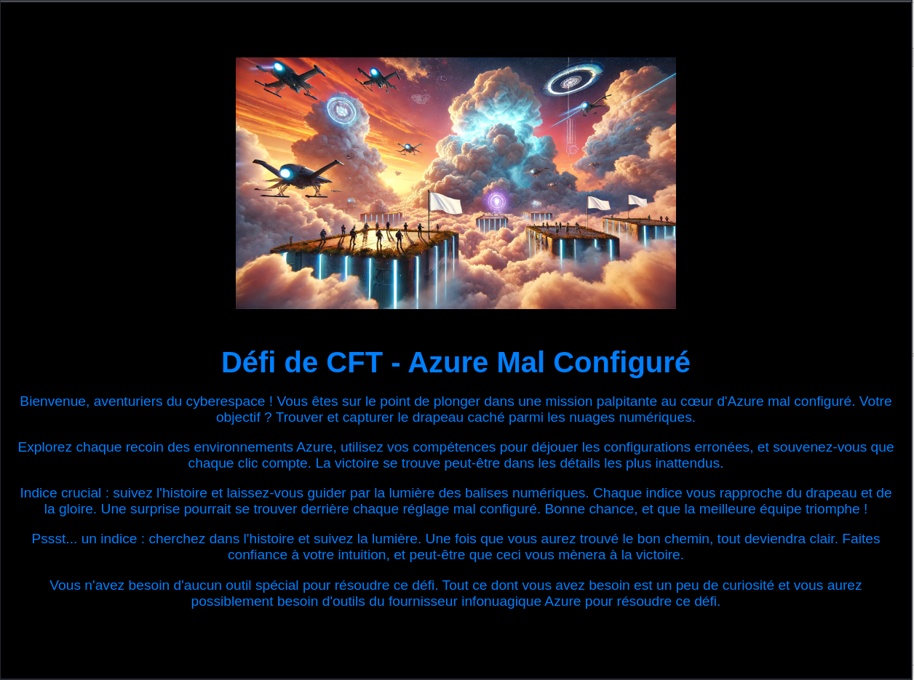

Il n'y a aucune intéractions possible avec la page, par contre elle nous donne des indices pour les prochaines étapes. "robots.txt" ne contient rien d'intéressant non plus, reste à vérifier les sources.

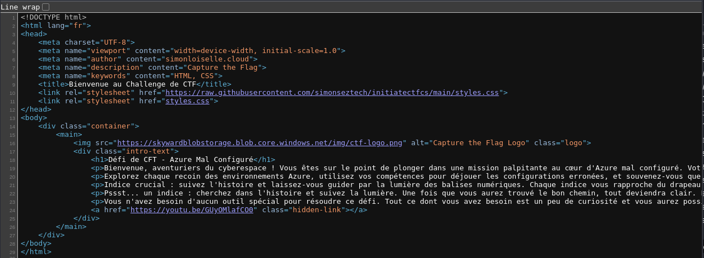

Les sources nous donne deux pistes intéressantes et un [vidéo inspirant](https://www.youtube.com/watch?v=GUyOMlafCO0). La première piste est que l'image est hébergée dans un [Azure Blob storage](https://learn.microsoft.com/en-us/azure/storage/blobs/storage-blobs-introduction). La deuxième est une ressource hébergée à même un repos Github publique.

Débutons par le blob. l'url complet de la ressource est:  

`https://skywardblobstorage.blob.core.windows.net/img/ctf-logo.png`

- `skywardblobstorage` est le storage account
- `img` est le nom du conteneur
- `ctf-logo.png` est le fichier hébergé

L'image doit être publique pour être utilisable, alors une misconfiguration possible serait que le container au complet soit ait les permission publiques.
Il existe plusieurs outils pour explorer les différentes options de stockage Azure tel que [Az storage explorer](https://azure.microsoft.com/en-ca/products/storage/storage-explorer), Extention VScode, AZ Cli, etc. Mais on peut facilement explorer un container public via l'API web.

`https://skywardblobstorage.blob.core.windows.net/img?restype=container&comp=list`

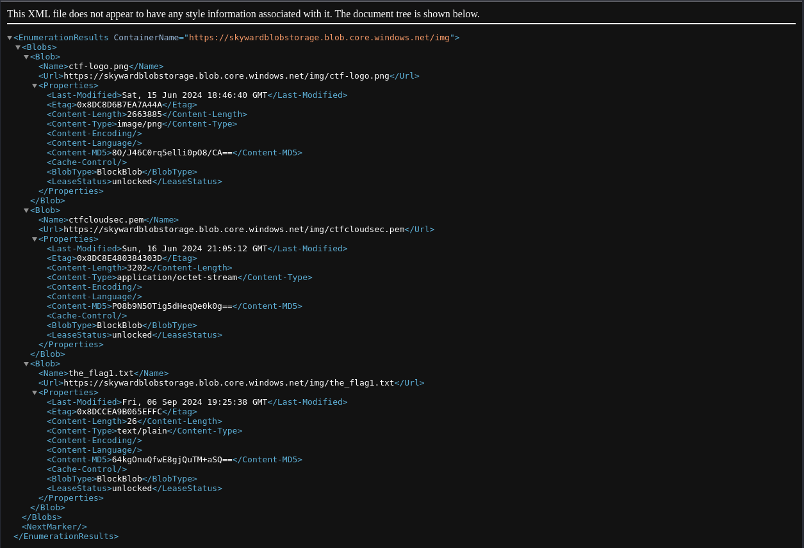

Ce endpoint liste les blobs (fichiers) du container et leur metadata. On obtien notre **premier flag** au `https://skywardblobstorage.blob.core.windows.net/img/the_flag1.txt`

et aussi un certificat + PK au format PEM  
`ctfcloudsec.pem`
Ce certificat nous servira plus tard.

## Partie 2

On revien aux deux pistes initiales. La deuxième url d'intéret était :
`https://raw.githubusercontent.com/simonseztech/initiatectfcs/main/styles.css`

Cette adresse pointe sur le contenu brut d'un fichier présent dans un repos qui semble appartenir au développeur. On peut ajuster l'url pour visualiser le repos en question
`https://github.com/simonseztech/initiatectfcs`

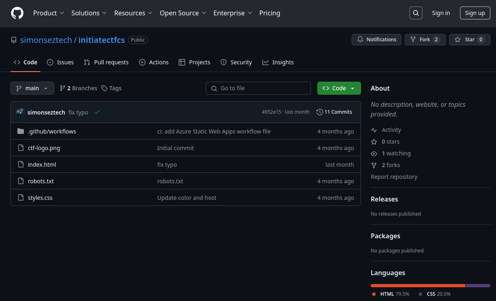

Le repos contient tout les fichiers du site web et un pipeline de déploiement. En explorant un peu, tout semble en ordre à première vue. Par contre, on remarque la présence d'une branche de développement.

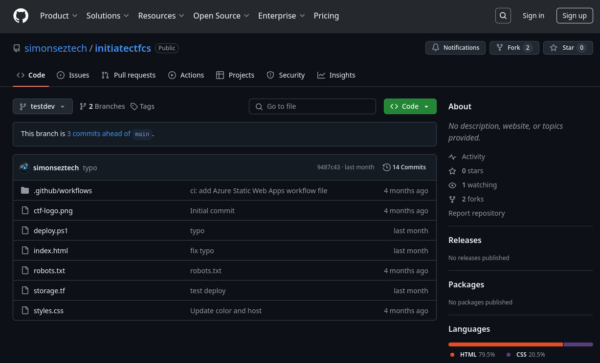

Cette branche contient deux fichiers additionnels, un script de déploiement et un fichier Terraform. En les observant, tout semble en ordre vu l'utilisation de variables d'environnement. Par contre, si on se souvient, la page web nous disait de *chercher dans l'histoire pour trouver la lumière*.

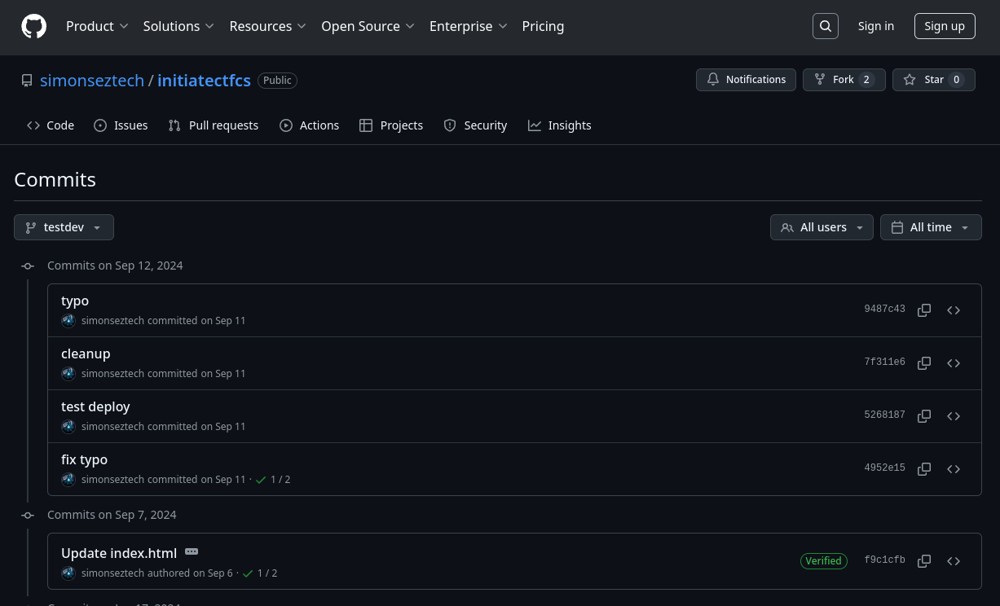

La branche dev a quelques commits distinct de la branche main.

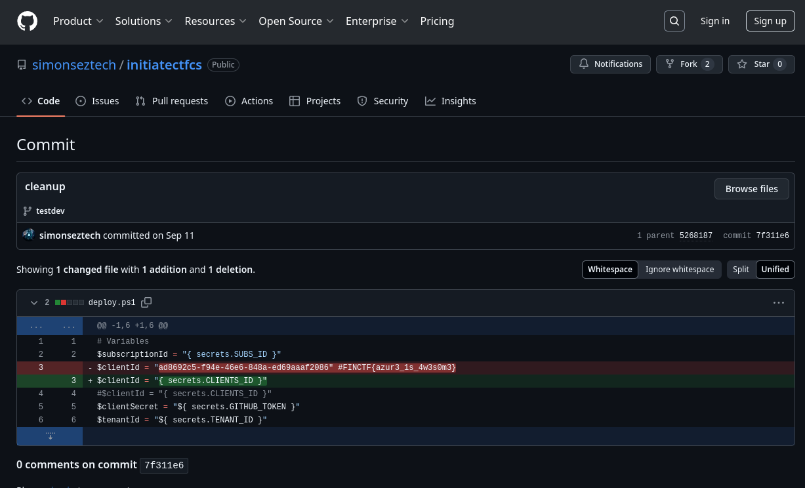

Le commit `cleanup` tente de retirer le client id secret en dur publié par erreur ainsi que notre deuxième flag.

## Partie 3

Pour le troisième flag on nous demande de trouver le tennant id du compte Azure. L'id ne semble pas avoir été laissé dans le repos.

Le tenant id est une information confidentielle. On obtient pas simplement le tenant id comme ça, il doit probablement avoir une faille majeure à explo...[il y a un lookup sur internet.](https://aadinternals.com/osint/)

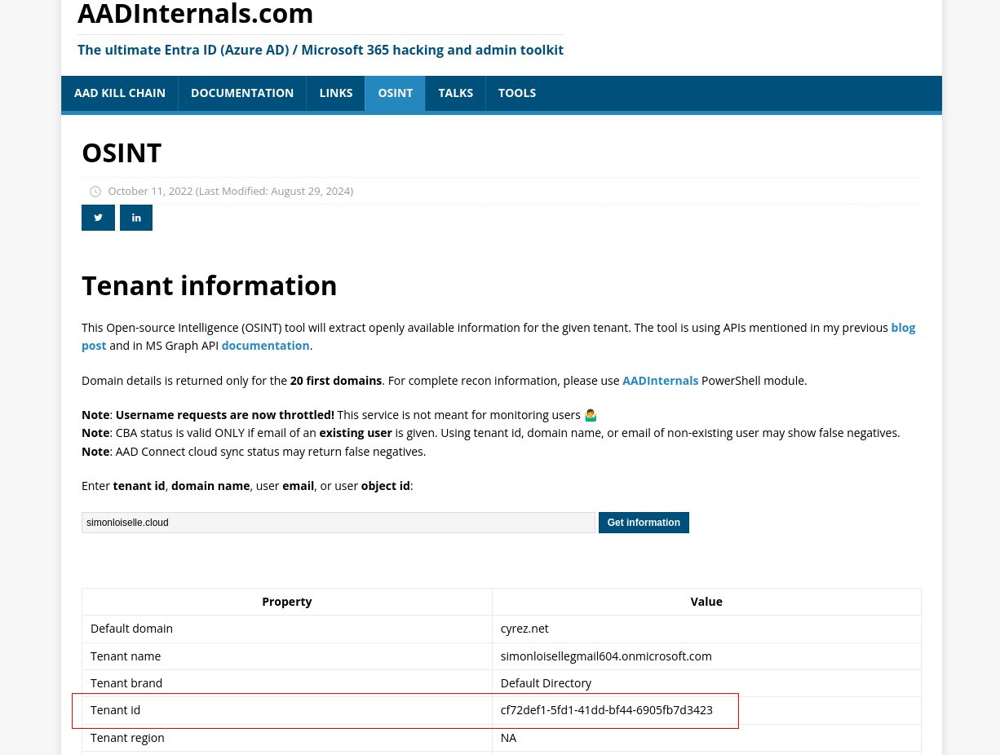

Il y a un lookup sur internet?!

Secoué un peu par cette révélation, on se retrouve avec le tenant id et par conséquant le flag #3 avec décoration
FLAG{**cf72def1-5fd1-41dd-bf44-6905fb7d3423**}

## Partie 4

On a maintenant tout ce qu'il faut pour prendre le contrôle de l'abonnement Azure. Nous n'avons pas accès au portail web, par contre le [CLI Azure](https://learn.microsoft.com/en-us/cli/azure/) nous permet de nous authentifier avec un certificat.

`az login --service-principal --username ad8692c5-f94e-46e6-848a-ed69aaaf2086 --tenant cf72def1-5fd1-41dd-bf44-6905fb7d3423 --password ctfcloudsec.pem`

Où :

- `username` est le client id récupéré dans la partie 2
- `tenant` est le tenant id de la partie 3
- `password` est le chemin vers le certificat du tout début

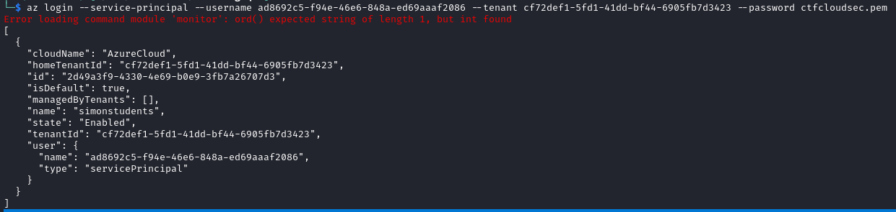

On est connecté! On peut maintenant lister toutes les resources de l'abonement

`az resource list`

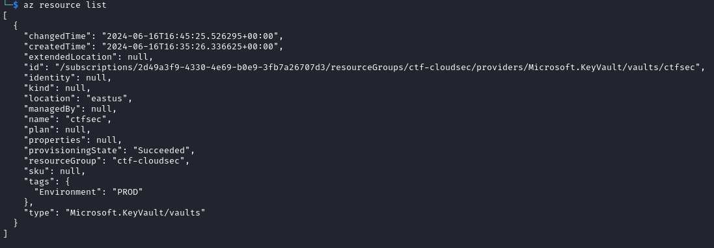

L'abonnement contient un keyvault nommé `ctfsec`
On peut lister les secrets avec cette commande :

`az keyvault secret list --vault-name ctfsec`

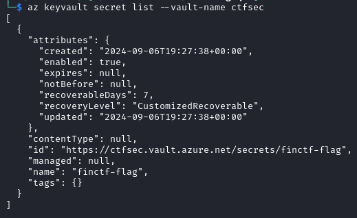

et finallement, afficher le contenu du secret `finctf-flag`

`az keyvault secret show --vault-name ctfsec --name finctf-flag --query value`

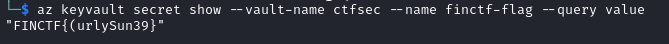

On obtient notre quatrième et dernier flag.
