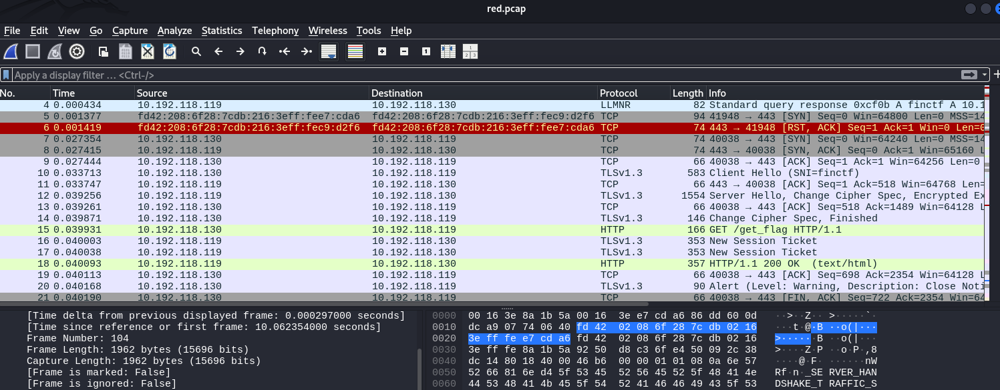
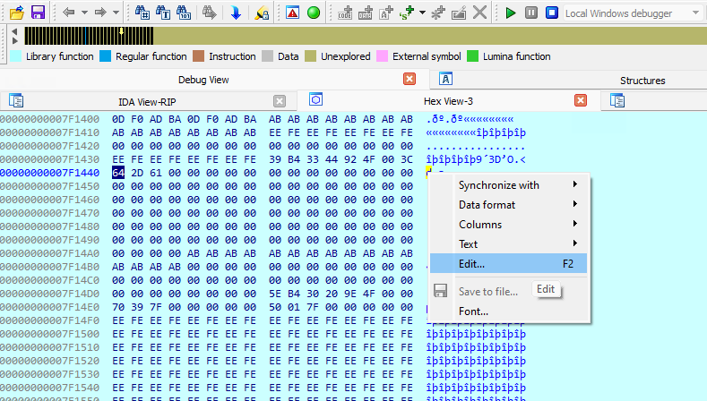
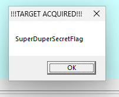

# Dig the PCAP

Ceci est une track de trois challenges visant, *en surface,* à explorer un [fichier packet capture wireshark](https://www.wireshark.org/docs/wsdg_html_chunked/ChWorksCaptureFiles.html)

## Partie 1

Quand on ouvre le fichier pour la première fois, on y vois principalement des échanges TLS (voir ici probablement des requêtes HTTPS), alors le contenu est encrypté.

On observe aussi des requêtes DNS mais rien de louche jusqu'à présent.

Plus loin dans le fichier on peux voir un échange tcpv6 qui semble être identifié comme FTP.

On peux filtrer et isoler le stream pour éviter d'avoir du bruit dans les échange et analyser se qui se passe.
Il suffit de faire `stream -> follow TCP` dans le menu contextuel d'un des échanges

Tous les échanges FPT sont en texte clair par design, on peut voir étape par étape les intérations entre le client FTP (fd42:208:6f28:7cdb:216:3eff:fee7:cda6 en rouge) et le serveur (fd42:208:6f28:7cdb:216:3eff:fe8a:1b5a en bleu)

- La connection est ouverte et le serveur s'identifie
- Le client s'authentifie en tant que `root`
- Le serveur liste ses capabilitées
- Le client initialise l'envoi d'un fichier **FLAG-FTPisNotSecure.log** en mode binaire
- Le serveur confirme l'écriture

On obtient le premier flag via le nom du fichier

## Partie 2

En poussant l'investigation, puisque les transaction FTP ne sont pas encryptées, on peut extraire le contenu du fichier qui à été transféré.

Dans la capture, si on enlève nos filtres, on voit un packet de type `FTP-DATA`

On peut facilement extraire le contenu avec Wireshark en utilisant `File -> Export objects -> FTP-DATA...` dans le menu.

On se retrouve avec un fichier qui à ce contenu

Il s'agit d'une fichier de clé privée TLS!
Ce fichier nous permet surement de décrypter le packet TLS du début.

Wireshark permet de décrypter automatiquement ces packet si on fourni ces clés. Pour ce fait il suffit de référencer notre fichier dans les préférences du protocole.

`Edit -> Preferences... -> Protocols -> TLS -> (Pre)-Master-Secret log filename`

Le détail des packet TLS est maintenant en texte clair. On peut confirmer qu'il s'agissait bien d'échanges `HTTP`

Un des packet retient particulièrement l'attention, une requête "**get_flag**". On peut faire un "Follow HTTP stream" pour visualiser l'échange.

On obtient notre deuxième flag.

## Partie 3

Pour la partie trois, on remarque qu'il y a une autre requête HTTP `get_stager`.

Facile! juste a faire un autre "follow HTTP stream" et voilà... woah... euh.

Ok... ok c'est c'est un fichier binaire. Facile! on a juste l'exporter via `file -> Export objects -> HTTP...`

On obtien un fichier que l'ont nomme `stager` qui est en fait... c'est quoi c'est ça... Facile, petite commande `file` et le tour...

Oh... ok weird... un vieil exécutable MSDOS ?

Ok! rien que Ghidra ne peut pas décortiqu...

Oh... ok on va spécifier à bras le format...
x86...dos.. 16bit j'imagine... boom voilà le...

Oh... rien... file a sorti un faux positif.

Ok... [binwalk?](https://github.com/ReFirmLabs/binwalk)

Strings?

Uh oh... un fichier encrypté ? [Cyberchef](https://gchq.github.io/CyberChef/)... Help!

Rien... 

Le fichier a une entropie plutôt élevée, ce qui semble indiquer de la compression ou de l'encryption. 
`Shannon entropy: 7.805210342220194`

Mais il n'y a pas de clé nul part dans le pcap... Si on observe le raw hex dump:

On vois des patterns de répétition pas vraiment communs pour une <u>*bonne*</u> encryption. Un simple [XOR?](https://en.wikipedia.org/wiki/XOR_cipher) avec quoi ? ...
...
...

...

*La compétion est terminée*
*La poussière retombe*
*Il n'y a plus de pression*

*mais c'est toujours là, quelque chose qui m'échappe et reste suspendu au dessus de ma tête...*

*peut-être mieux d'abandonner et garder le peu de santé mentale qui..*

Oh les indices sont maintenant gratuit !!!1 :D

`Indice : Le fichier est en shellcode lol`

Shelcode? cossésa !? [oh fu...](https://en.wikipedia.org/wiki/Shellcode)

Le fichier contient des instructions x86 assembly directement. le code n'est pas encapsulé dans un format [PE pour windows](https://en.wikipedia.org/wiki/Portable_Executable) ou [elf pour *nix](https://en.wikipedia.org/wiki/Executable_and_Linkable_Format) Ce type de code est conçu pour être un "payload" suite a un exploit et s'éxécute a l'interrieur d'un process existant.

Il est donc possible de visualiser ces instruction avec le [bon interpreteur](https://defuse.ca/online-x86-assembler.htm)

En utilisant Cyperchef on peut facilement convertir le fichier sous la bonne représentation pour le désassembler en spécifiant aussi `x64`.

On obtient du code machine que l'on peut analyser

- on saute a l'adresse 0x16
- on saute a la méthode à l'adresse 0x2
- Pop le stack dans le registre RDI (adresse 0x16)
- On met la valeur 0x7c3 dans RCX
- Met EAX à 0
- On boucle en décrémentant RCX, dans la boucle on XOR le byte a l'offset RDI + RCX avec le byte précédent

TLDR: C'est un bout de code polymorphique qui se XOR lui même en RAM. En gros tout le code à partir de 0x1b est décrypté au runtime.

Rendu ici, plusieurs options. On peut faire [un script](extractor.py) pour extraire le code obfusqué.

On peux aussi utiliser la fonction pratique `emulator` de Ghidra pour exécuter les instructions en simulation. On optien le "stage 2" dans la mémoire virtuelle.

Ma première tentative après avoir obtenu le "stage 2" à été de simuler un exploit et d'encapsuler le code dans un buffer et de l'éxécuter en c++. Ça permet au minumum à Ghidra de facilement décompiler le payload.

Le buffer est représenté comme "data" mais si on force une décompilation on peut analyser le code. En utilisant `Disassemble (F2)`

Le stage 2 comporte aussi quelques strings intéressantes

Le shellcode semble cibler windows et un utilisateur en particulier. Si l'utilisateur est le bon on devrait obtenir le flag.

Comprendre comment le code fonctionne et déchiffrer le flag semble plutôt compliqué. Peu de contexte tout est calculé dynamiquement etc...

Pourquoi pas juste éxécuter tout ça et attacher un débugueur ? Je lance une VM windows badabim badaboom. Je peux enfin aller me coucher!

Le problème est que mon petit programme c++ est pas mal broche a foin... les offset ne match plus et on obtien un segfault immédiatement.

J'ai finalement trouvé un outil pour encapsuler du shellcode dans un exécutable de façon "*safe*". [Shellcode2Exe](https://github.com/repnz/shellcode2exe)

Ça utilise Yasm pour assembler le shellcode dans un exécutable et le définir comme point d'entrée.

Immédiatement Windows defender panique et supprime mon exe...

C'est signe que je fait quelque chose de bien !

Un peu de persuasion et de "trust me bro" plus tard, j'ai un exe fonctionnel.

Pour débuguer, IDA représente bien le flow du code et est plutôt facile à lancer. J'ai remis le shellcode original (celui XORed) et ajouté un breakpoint au début de l'évantuel stage 2.

On voit un rapidement quelques appels de fonctions autour de texte en clair. Si on inspecte les valeur en mémoire des registre, on vois qu'on a "FinCTF4Life" dans RDX et qu'on a un autre registre populé avant un dernier appel de fonction. Dans RAX on à "d-a"... mon username Windows.

Possiblement la prochaine méthode est un "string compare"... On pourrait modifier la RAM directement et donner au programme ce qu'il veux entendre...

On laisse le tout aller...

... enfin. C'est fait...

*et puis... paix*
